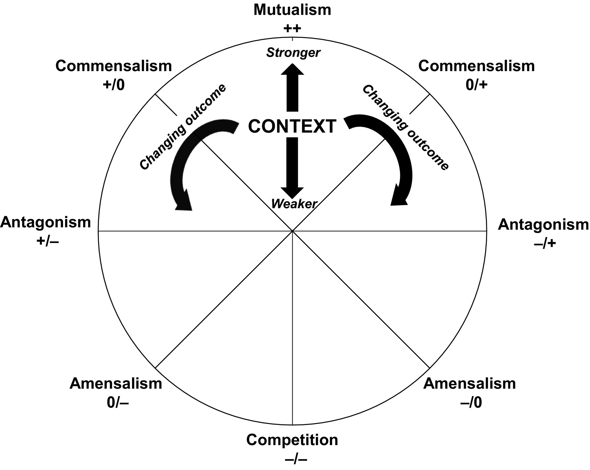
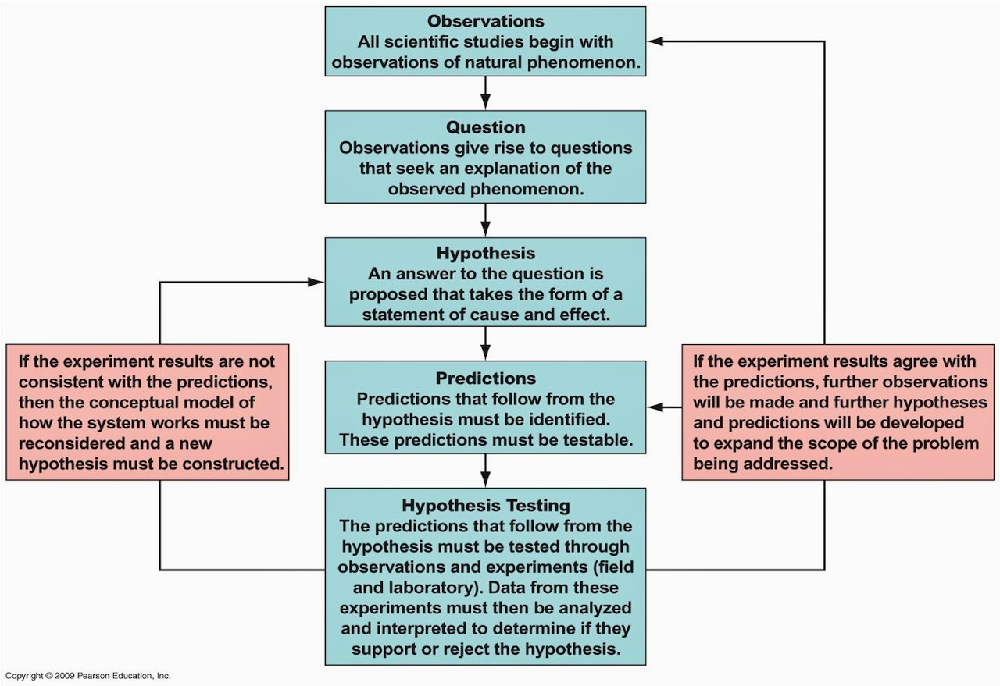
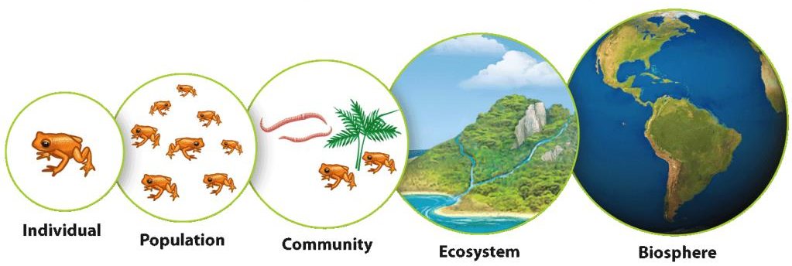
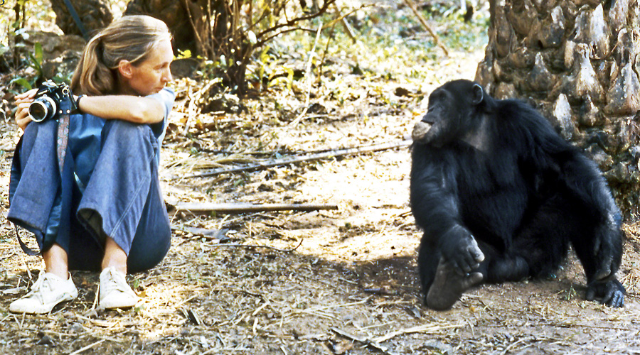
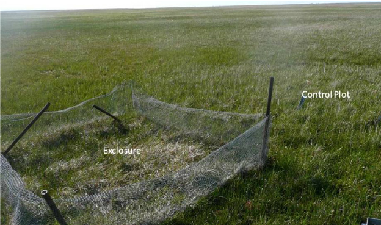
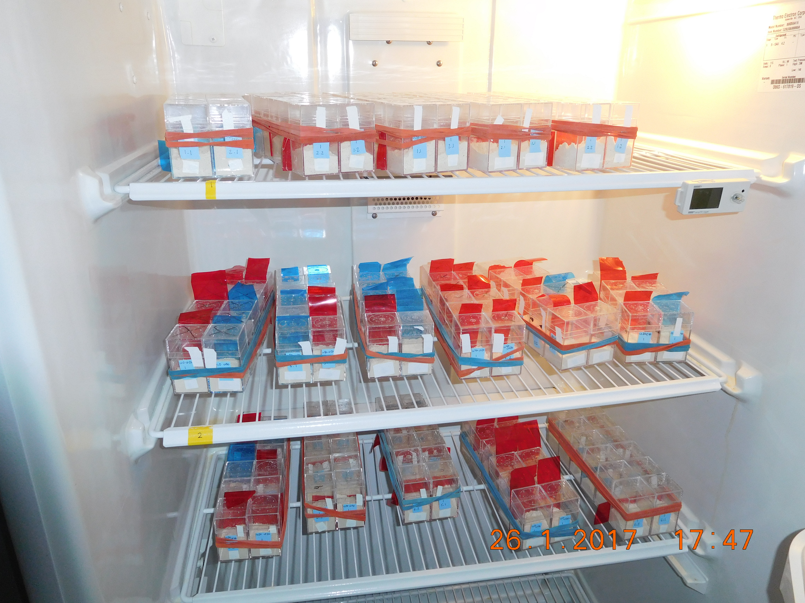

class: left, middle


```{r setup, include=FALSE}
options(htmltools.dir.version = FALSE)
knitr::opts_chunk$set(fig.align='center', echo = FALSE, out.width = '95%')
```


class: left, center, inverse

.font300[Announcements]  

## Note takers??


---
background-image: url('figs/li.JPG')
background-position: 50% 50%
background-size: cover
class: center, top

# Introduction to me

## https://www.dlilab.com 


---
class: center, middle

# .font200[[Syllabus](https://ecology.dlilab.com/syllabus/)]

---
class: center, middle

# .font200[[Final project](https://ecology.dlilab.com/project/)]

# Group of 3-5


---

# Readings

.font200[Purugganan, Mary, and Jan Hewitt. "How to read a scientific article." Rice University (2004). ]
<https://www.owlnet.rice.edu/~cainproj/courses/HowToReadSciArticle.pdf>


.font200[Ecological Society of America. What does ecology have to do with me?] 
<https://www.esa.org/about/what-does-ecology-have-to-do-with-me/>

---
class: center, left

# Currently there are about 7.9 billion people on earth. When did the human population reach half its current level?

.font300[
	a. 1790  
	b. 1931  
	c. 1960  
	d. 1974  
	e. 1985  
]

???

https://en.wikipedia.org/wiki/World_population

---
class: center, left

# How many species of animals and plants are there on earth?
	
.font300[
	a. 300,000  
	b. 1 million  
	c. 10 million  
	d. 30 million
]

---
class: center, left

# How many new bird species are discovered each decade?
	
.font300[
	a. 0  
	b. 1  
	c. 10  
	d. 60
]

???

https://en.wikipedia.org/wiki/List_of_bird_species_discovered_since_1900

---
class: center, left

# What fraction of the world's bird species has been driven extinct or near threatened by humans over the last 1,000 years?
	
.font300[
	a. 0.1%  
	b. 1%  
	c. 5%  
	d. 20%
]

---
class: center, left

# Scientists have been aware of the "greenhouse effect" for
	
.font300[
	a. 10 years  
	b. 25 years  
	c. 100 years
]

---
class: center, middle

# [R code demo](./Rcode.html)

---
class: center, middle

# That's all for today

---
class: center, middle

# What is ecology? 

## The study of .blue[interactions] among biological organisms and between organisms and their .red[environment].

---

# Interactions with same species

.font250[
+ Competition
  + food
  + space
  + mates
+ Cannibalism
+ Dispersal processes
]

---

# Interactions with different species

.pull-left[
.font250[
+ Competition
+ Predator -- prey
+ Plant -- pollinator
+ Host -- parasite
]
]

.pull-right[

]


---

# Interactions with the environment

.font250[
+ Allelopathy
+ Thermal tolerance
+ Disturbance ecology
+ Dispersal limitation
+ Ecosystem engineers
]

---
class: center, middle

# What ecology isn't

---

# Environmental Science

### Interdisciplinary field that draws concepts, expertise, and tools from natural and social sciences

### Ecology is a Component of Environmental Science

# Environmentalism

### A political and social ideology seeking to limit human impact on the environment 

### Ecology Can Inform Environmentalism


---

# Biomedicine

###  Gets conflated with ideas of "mainstream medicine"

### Generally applies to clinical practice and only to human populations (can some part of the environment make me better?)

---

# Natural history

### Descriptive study of natural organisms 

### Slightly separate from ecology, though ecological studies often utilize museum collections, and museum collections are essentially natural history storehouses

---

# Evolution

### Change of allele frequencies over time

### Strong feedbacks with ecological processes

>  .font250["Nothing in Biology Makes Sense except in the Light of Evolution"]
- Theodosius Dobzhansky

---

# Ecology is a Science



---

# levels of biological organization



---

# Individual 

## A single individual of a species. Unit of natural selection 

### e.g., a single trout in lake superior 

### domain of physiological and behaviour ecology; e.g., how do zebras regulate their internal water balance?


---

# Population

## A collection of individuals that occupy a given geographic area and interact with one another. Unit of evolution

### e.g., trout in lake superior

### population structure, growth, distribution and abundance? How these processes are affected by biotic (e.g., .blue[predator]) and abiotic aspects of the environment?

---

# Community 

## A set of interacting species that occupy a given geographic area.

### e.g., fish communities in lake superior, focus on kinds and diversity of organisms

### What factors influence the number of fishes living together in a lake? How multiple species be able to coexist in a small forest?

---

# Ecosystem

## The set of interacting species (the community) and the interactions between these species and their physical environment. 

#### e.g., a grassland, focus on ecological processes such as energy flow or nutrient cycle

### How does fire affect nutrient availability in grassland ecosystems?

---

# Biosphere

## The global environment, consisting of all living things on the planet.

### e.g., the planet

### What role does concentration of atmoospheric CO2 play in the regulation of global temperature?

---
class: middle

# Human activities have altered over 75% of the Earth's land surface. What is the role of the environment and land use change to each level?

---

background-image: url('figs/individual.png')
background-position: 50% 50%
background-size: contain
class: top, right, inverse

## Individual

[Mockford and Marshall 2009](https://royalsocietypublishing.org/doi/full/10.1098/rspb.2009.0586)

---

background-image: url('figs/population.jpg')
background-position: 10% 50%
background-size: contain
class: top, right, inverse

## Population

[Loss et al. 2013](https://www.nature.com/articles/ncomms2380)

---

background-image: url('figs/community.jpg')
background-position: 50% 50%
background-size: contain
class: top, left

## Community 

[Bovo et al. 2018](https://www.sciencedirect.com/science/article/pii/S2530064417301049)

---

background-image: url('figs/ecosystem.jpg')
background-position: 20% 50%
background-size: contain
class: top, right, inverse

## Ecosystem


---

background-image: url('figs/globalRisk.png')
background-position: 50% 70%
background-size: contain
class: top, right, inverse

## Biosphere

[Gilbert et al. 2018](https://www.nature.com/articles/sdata2018227)

---
class: center, middle

# How do we do ecology?


---

## Observations



[Dr. Jane Goodall](https://en.wikipedia.org/wiki/Jane_Goodall)

---

## Manipulative experiments



---

## Laboratory experiments


---

background-image: url('figs/models.jpg')
background-position: 0% 50%
background-size: contain
class: top, right, inverse


.pull-right[

# Ecological modeling 

<br> 

## SI model as an example

.font150[
$$S_{t+1} = bS_{t} - \beta S_{t} I_{t}$$
$$I_{t+1} = \beta S_{t}I_{t} - \gamma I_{t}$$ 
]
]

