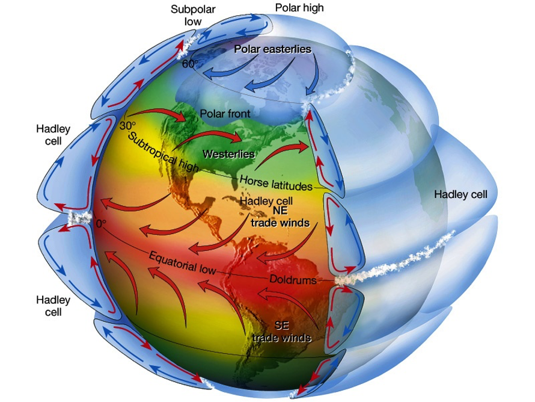
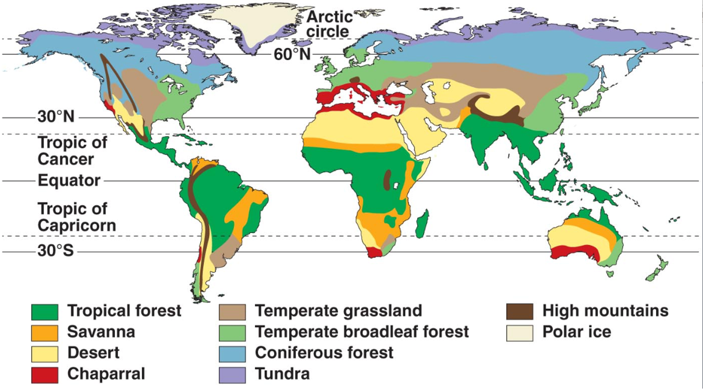
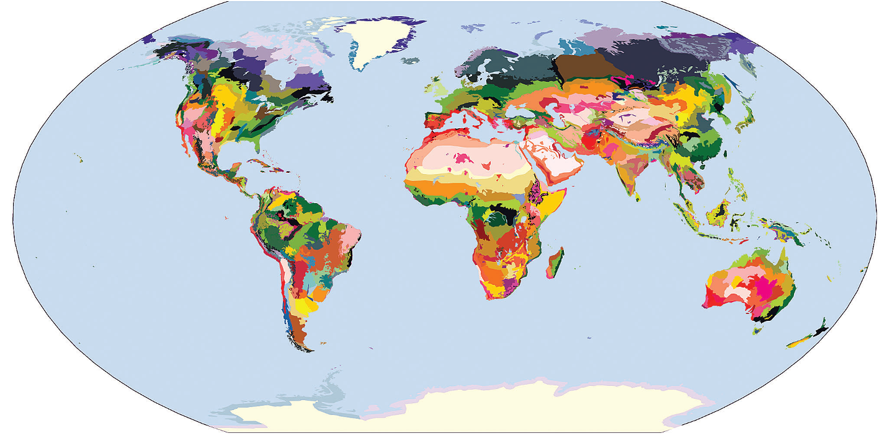
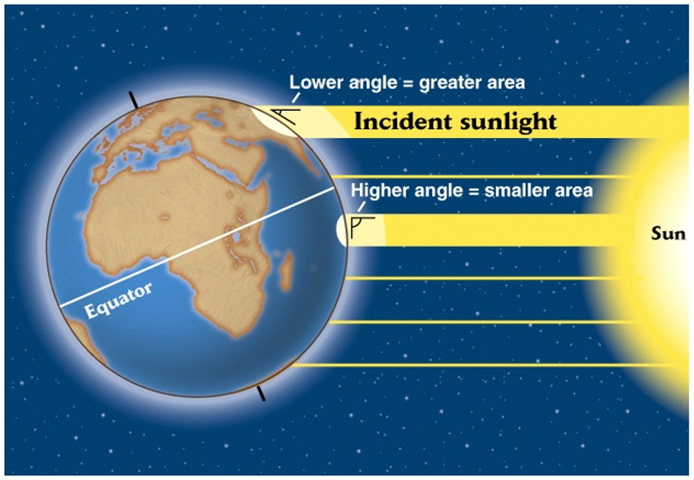
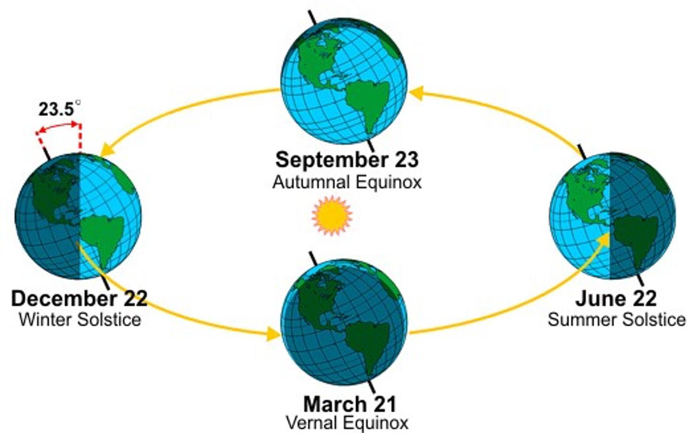

class: left, middle


```{r setup, include=FALSE}
options(htmltools.dir.version = FALSE)
knitr::opts_chunk$set(fig.align='center', echo = FALSE, out.width = '95%')
```


class: left, center, inverse

.font300[Announcements]  


---
class: center, top

## An understanding of the physical environment is key to understanding all ecological phenomena




---
background-image: url('figs/biomes.svg')
background-position: 90% 50%
background-size: contain
class: left, top


# .blue[Biomes]

---

# Biomes

#### Large-scale biological communities sharing _similar_ **plant** growth forms; often owing to convergent adaptations to similar physical environments; determined largely by temperature and rainfall (climate)

.center[]

???

how does a particular environment result in similar plants? selective pressure lead to similar functional traits through evolution

why defined by plants? plants form the foundation of life on earth; they are primary producers

---

# Ecoregions (867 distinct ones)

.center[]

Olson et al 2001 _Bioscience_

.font200[Other factors such as soil types and elevation can also have strong influences]

???

how many biomes depends on who do you ask; or how different to go

---

# Major Determinants of Global Climate

### 1. Spherical shape of the earth: uneven heating

.center[]

???

while the global distribution of biomes is determined by climate, what determines the distributions of climate?

---

# Major Determinants of Global Climate

### 2. Revolution of the Earth around the Sun on a tilted axis (seasons)

.center[]

