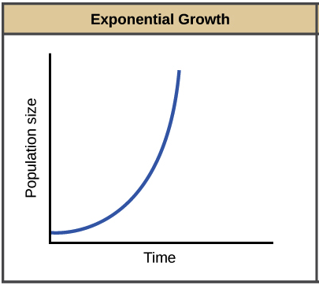
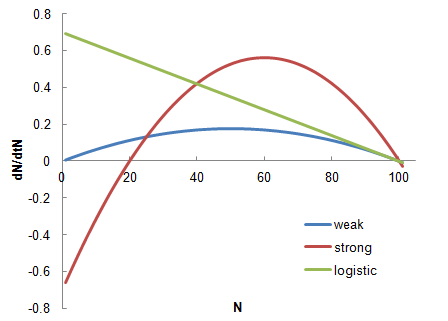

class: left, middle


```{r setup, include=FALSE}
options(htmltools.dir.version = FALSE)
knitr::opts_chunk$set(fig.align='center', echo = FALSE, out.width = '95%')
```


class: left, center, inverse

.font300[Announcements

]  

---
class: center, middle, inverse

.font200[
What controls the dynamics of species populations through time? That is, what controls the rate at which populations increase/decrease? 

Why don't species exhaust their resources and crash?

]

--

.font200[
We'll start with a simple base model, and then build up to examine more realistic population demographics.
]

---

# A generalized model of population dynamics

$$N_{t+1} = N_{t} + Births + Immigration - Deaths - Emigration$$
--

.font150[For a closed population (no movement of individuals into or out of the patch), this reduces to]

$$N_{t+1} = N_{t} + Births - Deaths$$


---
class: center, top

# Exponential growth

```{r out.width='70%'}

```

---

```{r out.width='100%'}
knitr::include_graphics('figs/humans.png')
```


---

# Exponential growth

## Discrete model

### The simplest model of population dynamics is based on an exponential increase in population size given a positive growth rate. That is, the population at the next time point $N_{t+1}$ is based on the population size at the current time $N_{t}$ times the growth rate of the population (λ).

$$N_{t+1} = \lambda \times N_t$$ 

.font150[This means that each individual produces $R$ offspring per timestep (generation), which then go on to produce $R$ offspring. The issue with this model is that there is nothing to stop it, so the time series of the population size quickly becomes exponential (as we'll see in the coding demonstration). ]

---

# Exponential growth

## Continuous model

.font150[A discrete model makes sense when this assumption matches the species biology. That is, if the species reproduces once per year, or if generation time can be bounded within some time window, then a discrete model might capture the relevant dynamics well. Let's consider a system where we want that time window to be incredibly small.]

$$ \frac{dN}{dt} = rN $$ 

.font150[ where $r$ is equal to $b$ - $d$ (**births - deaths**), where $b$ and $d$ are per capita measures (births or deaths per individual per unit time). This $r$ is the .red[_instantaneous rate of increase_]. When $r < 0$, the population decreases towards 0. When $r > 0$ the population increases exponentially (essentially geometrically, but in continuous time). ]

---

```{r out.width='100%'}
knitr::include_graphics('figs/logo.jpg')
```


---

```{r out.width='100%'}

```
