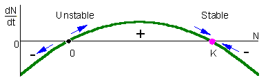

class: left, middle


```{r setup, include=FALSE}
options(htmltools.dir.version = FALSE)
knitr::opts_chunk$set(fig.align='center', echo = FALSE, out.width = '95%')
```


class: left, center, inverse

.font300[Announcements

]  

---
class: center, middle, inverse

.font200[
What controls the dynamics of species populations through time? That is, what controls the rate at which populations increase/decrease? 

Why don't species exhaust their resources and crash?

]

--

.font200[
We'll start with a simple base model, and then build up to examine more realistic population demographics.
]

---

# A generalized model of population dynamics

$$N_{t+1} = N_{t} + Births + Immigration - Deaths - Emigration$$

--

.font150[For a closed population (no movement of individuals into or out of the patch), this reduces to]


$$N_{t+1} = N_{t} + Births - Deaths$$


---
class: center, top

# Exponential growth

```{r out.width='70%'}
knitr::include_graphics('figs/expo.png')
```

---

```{r out.width='100%'}
knitr::include_graphics('figs/humans.png')
```


---

# Exponential growth

## Discrete model

#### The simplest model of population dynamics is based on an exponential increase in population size given a positive growth rate. That is, the population at the next time point $N_{t+1}$ is based on the population size at the current time $N_{t}$ times the .red[finite rate of increase] of the population (λ).

$$N_{t+1} = N_t + r_dN_t = (1 + r_d)N_t = \lambda N_t$$ 

#### This means that each individual produces $r_d$ (.red[discrete growth factor]) offspring per timestep (generation), which then go on to produce $r_d$ offspring. The issue with this model is that there is nothing to stop it, so the time series of the population size quickly becomes exponential (as we'll see in the coding demonstration). 

---

# Exponential growth

## Continuous model

#### A discrete model makes sense when this assumption matches the species' biology. That is, if generation time can be bounded within some time window, then a discrete model might capture the relevant dynamics well. Let's consider a system where we want that time window to be incredibly small.

$$ \frac{dN}{dt} = rN $$ 

#### where $r$ is equal to $b$ - $d$ (**births - deaths**), where $b$ and $d$ are per capita measures (births or deaths per individual per unit time). This $r$ is the .red[_instantaneous rate of increase_]. When $r < 0$, the population decreases towards 0. When $r > 0$ the population increases exponentially (essentially geometrically, but in continuous time). 

---

# Exponential growth

## Continuous model

$$ \frac{dN}{dt} = rN $$ 

#### This equation can be simplified back to discrete time, and we see the population size at time _t_ is:


$$ N_{t} = N_0e^{rt} $$ 


#### Where $N_0$ is the initial population size, $r$ is the instantaneous rate of increase, and $t$ is the number of time steps. 

#### This can also be used to project the expected population growth over time, where $t$ can be any number greater than 1. 

---
class: middle

# Exponential growth

.pull-left[
### Discrete model:

$$N_{t+1} = \lambda N_t$$ 

### Continuous model:

$$ \frac{dN}{dt} = rN $$ 

$$ N_{t} = N(0)e^{rt} $$ 
]


--

.pull-right[
$$ r = ln(\lambda) $$ 


$\lambda < 1$, $r < 0$: .font120[population decrease to 0]

$\lambda = 1$, $r = 0$: .font120[population unchanging] 

$\lambda > 1$, $r > 0$: .font120[population increase to infinity]
]

---
background-image: url('figs/growth_r.png')
background-position: 0% 40%
background-size: contain
class: center, bottom

$$ r = ln(\lambda) $$ 

$\lambda < 1$, $r < 0$: .font120[population decrease to 0]  
$\lambda = 1$, $r = 0$: .font120[population unchanging]  
$\lambda > 1$, $r > 0$: .font120[population increase to infinity]

---

# Assumptions of the exponential model:

.font200[
+ No immigration or emigration
+ Constant $r$ (b-d); which means unlimited resources
+ No age, size, or genetic structure (all individuals are functionally equivalent)
+ Continuous growth without time lags
]

--

.font200[Exponential growth model forms the cornerstone of population density. Even though no population can increase exponentially forever, all populations have the .red[_potential_] for exponential growth.]

---

# Logistic growth

.font200[

“No population can increase in size forever.”

Number of atoms in the universe (finite mass) is around $10^{80}$. Exponential growth potential of _E. coli_: beginning with 1 cell, 6 days for population > $10^{80}$ cells.

It may be more realistic to assume that populations intrinsically limit themselves. That is, competition for space, resources, and mates, produces an upper limit to the population size.
]

---

# Exponential growth vs. Logistic growth

```{r out.width='100%'}
knitr::include_graphics('figs/logo.jpg')
```


---

# Logistic growth

## Discrete model

#### In the discrete model, we see that the population still grows at rate $\lambda$, but overall population size is discounted by a scaling term which relates the population size ( $N_t$ ) to an upper threshold. This threshold is the .red[**carrying capacity**] ( $K$ ), which is the maximum sustainable population size, given potentially limiting resource such as resources, space, etc.

$$N_{t+1} = N_{t} + (ln(\lambda) \times N_{t} \times (1 - \frac{N_t}{K}))$$


---

# Logistic growth

## Continuous model

#### In the continuous model, time step size goes to 0 in the limit (i.e., the time steps are really tiny). When the population size exceeds $K$ (for either discrete or continuous models) population growth becomes negative, leading to a tendency for the system to go to $K$. However, this is sensitive to population growth rate ( $\lambda$ or $r$), as large growth rates can lead to complex dynamics, including damped oscillations, limit cycles, and chaos. 


$$ \frac{dN}{dt} = rN \left[1- \frac{N}{K}\right];  r, K > 0$$

---

# Logistic growth

## Continuous model

$$ \frac{dN}{dt} = rN \left[1- \frac{N}{K}\right];  r, K > 0$$

#### Note: in this model, $r$ and $K$ must be greater than 0.

$\lambda < 1$, $r < 0$: .font150[population decrease to 0]

$\lambda = 1$, $r = 0$: .font150[population does not change]

$\lambda > 1$, $r > 0$: .font150[population increase to carrying capacity]

---

# Assumptions of the logistic model:

.font200[

On top of the assumptions of the exponential growth,

+ Constant carrying capacity

+ Linear density dependence (population size limits population growth, with each additional individual reducing growth rate equally)
]

---

# Logistic growth

#### When the population size exceeds $K$ (for either discrete or continuous models) population growth becomes negative, leading to a tendency for the system to go to $K$. However, this is sensitive to population growth rate ( $\lambda$ or $r$), as large growth rates can lead to complex dynamics, including damped oscillations, limit cycles, and chaos. 

.pull-left[

### Equilibria:

.font150[N = K, 0 < r < 3.5 (stable)]

.font150[N = 0, 0 < r < 3.5 (unstable)] 

.font150[N = K, r < 0 (unstable)] 

.font150[N = 0, r < 0 (stable)] 
]


.pull-right[

]

---

# Allee effect 

#### $b$ or $d$ is non-linear, resulting in a population growth rate $r$ which depends on $N_{t}$. 

#### Allee effect is the positive correlation between population size $N_{t}$ and population growth rate $r$. 

#### Allee effects are important when population sizes become small, as the density dependence can cause a situation where population growth rate actually drops below 0 ( $r < 0$). 

---

# Allee effect 

```{r out.width='100%'}
knitr::include_graphics('figs/allee.png')
```
