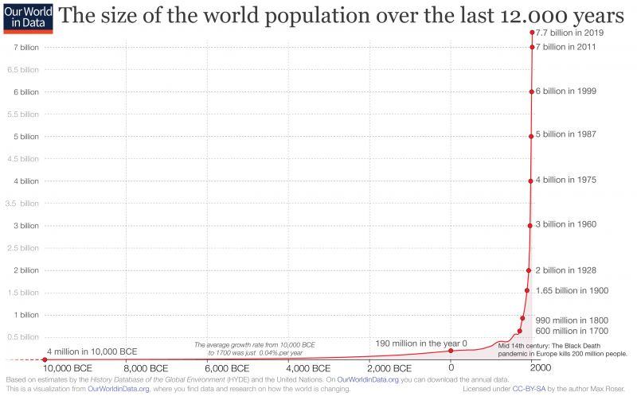
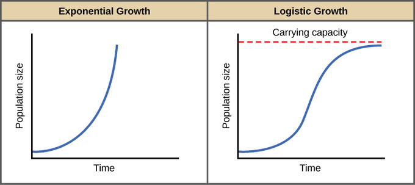
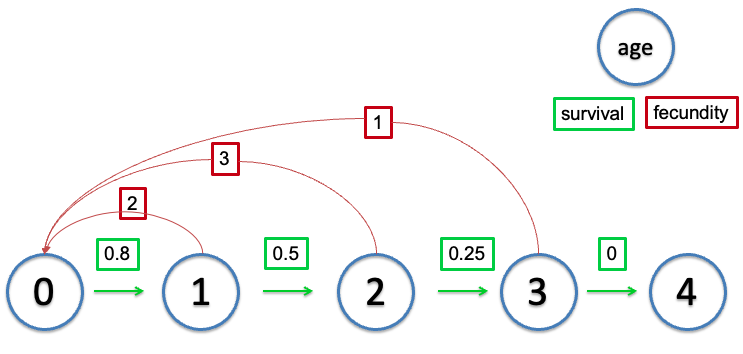
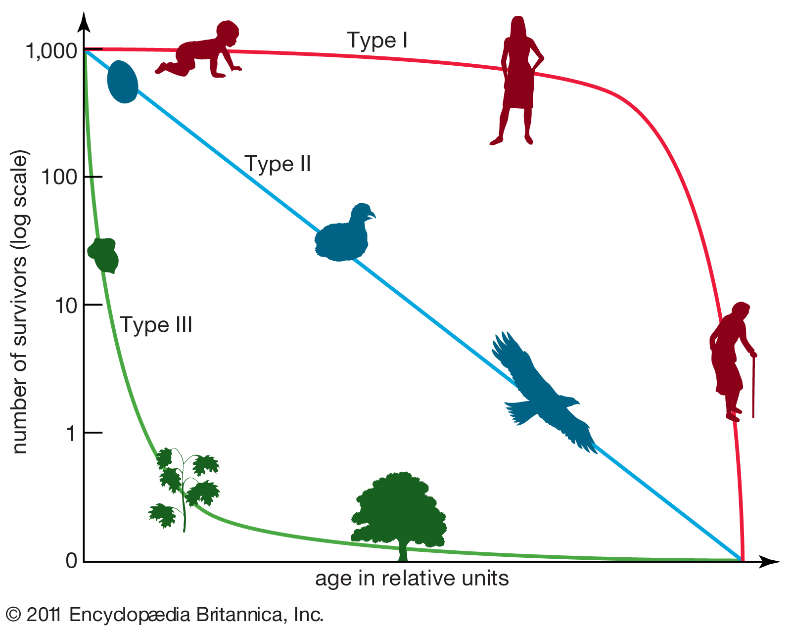
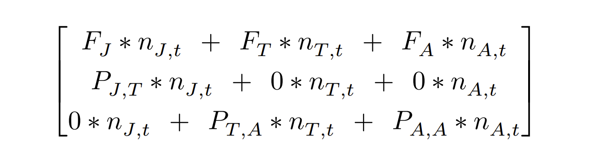
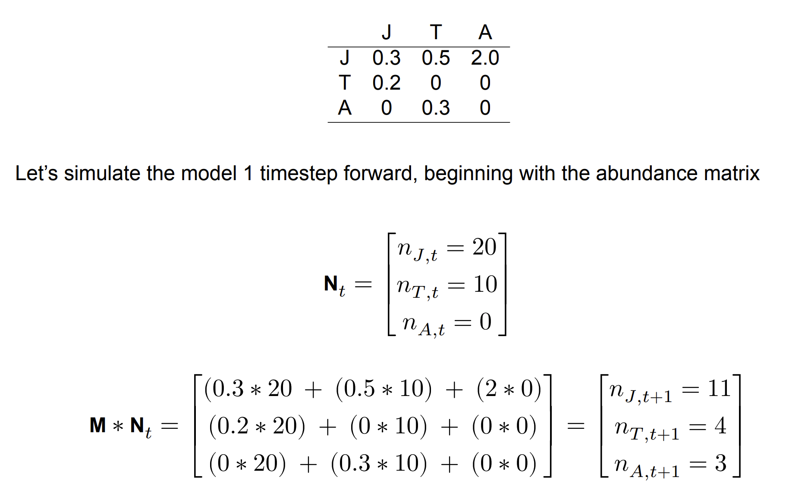

class: left, middle


```{r setup, include=FALSE}
options(htmltools.dir.version = FALSE)
knitr::opts_chunk$set(fig.align='center', echo = FALSE, out.width = '95%')
```


class: left, center, inverse

.font300[Announcements

]  

---
class: center, middle, inverse

.font200[
What controls the dynamics of species populations through time? That is, what controls the rate at which populations increase/decrease? 

Why don't species exhaust their resources and crash?

]

--

.font200[
We'll start with a simple base model, and then build up to examine more realistic population demographics.
]

---

# A generalized model of population dynamics

$$N_{t+1} = N_{t} + Births + Immigration - Deaths - Emigration$$

--

.font150[For a closed population (no movement of individuals into or out of the patch), this reduces to]


$$N_{t+1} = N_{t} + Births - Deaths$$


---
class: center, top

# Exponential growth

```{r out.width='70%'}
knitr::include_graphics('figs/expo.png')
```

---

```{r out.width='100%'}

```


---
class: largerFont


# Exponential growth

## Discrete model

The simplest model of population dynamics is based on an exponential increase in population size given a positive growth rate. That is, the population at the next time point $N_{t+1}$ is based on the population size at the current time $N_{t}$ times the .red[finite rate of increase] of the population (λ).

$$N_{t+1} = N_t + r_dN_t = (1 + r_d)N_t = \lambda N_t$$ 

This means that each individual produces $r_d$ (.red[discrete growth factor]) offspring per timestep (generation), which then go on to produce $r_d$ offspring. The issue with this model is that there is nothing to stop it, so the time series of the population size quickly becomes exponential (as we'll see in the coding demonstration). 

---
class: largeFont

# Exponential growth

## Continuous model

A discrete model makes sense when this assumption matches the species' biology. That is, if generation time can be bounded within some time window, then a discrete model might capture the relevant dynamics well. Let's consider a system where we want that time window to be incredibly small.

$$ \frac{dN}{dt} = rN $$ 

where $r$ is equal to $b$ - $d$ (**births - deaths**), where $b$ and $d$ are per capita measures (births or deaths per individual per unit time). This $r$ is the .red[_instantaneous rate of increase_]. When $r < 0$, the population decreases towards 0. When $r > 0$ the population increases exponentially (essentially geometrically, but in continuous time). 

---
class: largeFont

# Exponential growth

## Continuous model

$$ \frac{dN}{dt} = rN $$ 

This equation can be simplified back to discrete time, and we see the population size at time _t_ is:


$$ N_{t} = N_0e^{rt} $$ 


Where $N_0$ is the initial population size, $r$ is the instantaneous rate of increase, and $t$ is the number of time steps. 

This can also be used to project the expected population growth over time, where $t$ can be any number greater than 1. 

---
class: middle

# Exponential growth

.pull-left[
### Discrete model:

$$N_{t+1} = \lambda N_t$$ 

### Continuous model:

$$ \frac{dN}{dt} = rN $$ 

$$ N_{t} = N(0)e^{rt} $$ 
]


--

.pull-right[
$$ r = ln(\lambda) $$ 


$\lambda < 1$, $r < 0$: .font120[population decrease to 0]

$\lambda = 1$, $r = 0$: .font120[population unchanging] 

$\lambda > 1$, $r > 0$: .font120[population increase to infinity]
]

---
background-image: url('figs/growth_r.png')
background-position: 0% 40%
background-size: contain
class: center, bottom

$$ r = ln(\lambda) $$ 

$\lambda < 1$, $r < 0$: .font120[population decrease to 0]  
$\lambda = 1$, $r = 0$: .font120[population unchanging]  
$\lambda > 1$, $r > 0$: .font120[population increase to infinity]

---

# Assumptions of the exponential model:

.font180[
+ No immigration or emigration
+ Constant $r$ (b-d); which means unlimited resources
+ No age, size, or genetic structure (all individuals are functionally equivalent)
+ Continuous growth without time lags
]

--

.font180[Exponential growth model forms the cornerstone of population density. Even though no population can increase exponentially forever, all populations have the .red[_potential_] for exponential growth.]

---

# Logistic growth

.font180[

“No population can increase in size forever.”

Number of atoms in the universe (finite mass) is around $10^{80}$. Exponential growth potential of _E. coli_: beginning with 1 cell, 6 days for population > $10^{80}$ cells.

It may be more realistic to assume that populations intrinsically limit themselves. That is, competition for space, resources, and mates, produces an upper limit to the population size.
]

---

# Exponential growth vs. Logistic growth




---
class: largerFont

# Logistic growth

## Discrete model

In the discrete model, we see that the population still grows at rate $\lambda$, but overall population size is discounted by a scaling term which relates the population size ( $N_t$ ) to an upper threshold. This threshold is the .red[**carrying capacity**] ( $K$ ), which is the maximum sustainable population size, given potentially limiting resource such as resources, space, etc.

$$N_{t+1} = N_{t} + (ln(\lambda) \times N_{t} \times (1 - \frac{N_t}{K}))$$


---
class: largerFont

# Logistic growth

## Continuous model

In the continuous model, time step size goes to 0 in the limit (i.e., the time steps are really tiny). When the population size exceeds $K$ (for either discrete or continuous models) population growth becomes negative, leading to a tendency for the system to go to $K$. However, this is sensitive to population growth rate ( $\lambda$ or $r$), as large growth rates can lead to complex dynamics, including damped oscillations, limit cycles, and chaos. 


$$ \frac{dN}{dt} = rN \left[1- \frac{N}{K}\right];  r, K > 0$$

---

# Logistic growth

## Continuous model

$$ \frac{dN}{dt} = rN \left[1- \frac{N}{K}\right];  r, K > 0$$

#### Note: in this model, $r$ and $K$ must be greater than 0.

$\lambda < 1$, $r < 0$: .font150[population decrease to 0]

$\lambda = 1$, $r = 0$: .font150[population does not change]

$\lambda > 1$, $r > 0$: .font150[population increase to carrying capacity]

---

# Assumptions of the logistic model:

.font200[

On top of the assumptions of the exponential growth,

+ Constant carrying capacity

+ Linear density dependence (population size limits population growth, with each additional individual reducing growth rate equally)
]

---
class: largerFont

# Logistic growth

When the population size exceeds $K$ (for either discrete or continuous models) population growth becomes negative, leading to a tendency for the system to go to $K$. However, this is sensitive to population growth rate ( $\lambda$ or $r$), as large growth rates can lead to complex dynamics, including damped oscillations, limit cycles, and chaos. 

.pull-left[

### Equilibria:

N = K, 0 < r < 3.5 (stable)

N = 0, 0 < r < 3.5 (unstable)

N = K, r < 0 (unstable)

N = 0, r < 0 (stable)
]


.pull-right[

]

---
class: largerFont

# Allee effect 

$b$ or $d$ is non-linear, resulting in a population growth rate $r$ which depends on $N_{t}$. 

Allee effect is the positive correlation between population size $N_{t}$ and population growth rate $r$. 

Allee effects are important when population sizes become small, as the density dependence can cause a situation where population growth rate actually drops below 0 ( $r < 0$). 

---

# Allee effect 

```{r out.width='100%'}

```

---
class: largerFont

# Structured populations

The above models assume that all individuals are functionally equivalent. That is, individuals contribute to overall reproductive output and population growth regardless of age, body size, sex, etc. But this is not really true for most natural populations. Most of the time, very young individuals won't reproduce, as they are not reproductively mature. This creates a situation where two populations containing the same number of individuals may have strikingly different dynamics, as the distribution of individuals' ages influences population growth rates. This occurs either through differences in birth rates (as noted above), or as a result of different death rates (e.g., young and old individuals have higher mortality risk than middle-aged).

---

# Life table

.font150[Originally designed for insurance companies, this is a way to track demographic rates through time, partitioning things by the age of the organism. ]



---

# Life table

```{r, lifeTable}
knitr::kable(
  lt <- tibble::tibble(
    `age (x)` = c(0:4),
    `S(x)` = c(500, 400, 200, 50, 0),
    `b(x)` = c(0, 2, 3, 1, 0),
    `l(x)=S(x)/S(0)` = `S(x)`/500,
    `g(x)=l(x+1)/l(x)` = c(0.8, 0.5, 0.25, 0, NA),
    `l(x)b(x)` = `l(x)=S(x)/S(0)` * `b(x)`,
    `l(x)b(x)x` = `l(x)b(x)` * `age (x)`
  ), caption = "Life table of a hypothetic population.", booktabs = TRUE
)
```

The term $S(x)$ refers to the number of individuals from a particular cohort that are still alive at age $x$ (.red[**cohort survival**]). 

The term $b(x)$ represents the per-capital birth rate for females of age $x$. This is the number of female offspring generated from one female individual of age $x$. For example $b(6) = 3$ would indicate that a female of age 6 will give birth to an _average_ of 3 female offspring. $b(x)$ also is referred to as .red[**fecundity schedule**].

The term $l(x)$ represents the probability that an individual survives from age 0 (birth) to the *beginning* of age $x$. This is called .red[**survival rate** or survival schedule]. $l(x)=S(x)/S(0)$

The term $g(x)$ is the probability that an individual of age $x$ survives to age $x+1$ (.red[**survival probability**]).

---
class: center

# Survivorship curves



---
class: largerFont

# Life Table

Life table gives us a good idea of how age or life stage can influence reproductive output and survival. 

$l(x)$ (survival rate) and $b(x)$ (fecundity rate) are the basis of all our life-table calculations. If we know $l(x)$ and $b(x)$, we can calculate the intrinsic growth rate $r$. To do that, we need to calculate two more number first: the .red[net reproductive rate] $R_0$ and the generation time $G$.

$R_0$ corresponds to the average number of female offspring that would be born to each female member of a population going from birth to death following to life table. 

$$R_0 = \sum^k_{x=0}l(x)b(x)$$

---

# Life table

```{r}
knitr::kable(lt, booktabs = TRUE)
```

.pull-left[
$$R_0 = \sum^k_{x=0}l(x)b(x)$$
]

.pull-right[
$$ R_{0} = 0 + 1.6 + 1.2 + 0.1 + 0 = 2.9 $$

$R_0 > 1$? $R_0 = 1$?  $R_0 < 1$? 
]

.font150[

$R_0$ is very _similar_ to $\lambda$ in terms of description. But, $r \neq ln(R_0)$ because $R_0$ measures increase of population as a function of _generation time_.

]

---

# Genetation time

.font180[ 

$G$ is the generation time, which is quantified as the average age of parents of all offspring produced in a single cohort. It can be calculated as

] 


$$G = \frac{\Sigma_{x=0}^{k} l(x)b(x)x}{\Sigma_{x=0}^{k} l(x)b(x)}$$

.font150[ _G = ?_ in the table below?]

```{r}
knitr::kable(lt, booktabs = TRUE)
```

---
class: middle

.font180[

From $R_0$ and $G$, we can compute $r$ and $\lambda$


$$ r \approx \frac{ln(R_0)}{G} $$

Calculate $r$ for the example in the table above:

$$ \lambda = e^{r} $$

]

---
class: largerFont

# Structured populations

So how do we model these structured populations? We could break the populations down into stages, and use the models described above for each life stage. Here is an example for a stage-structured population consisting of juveniles ( $J$), teenagers ( $T$), and adults ( $A$). Here, we can track the dynamics of each stage independently, as below. What's wrong with this? It doesn't explicitly consider the inherent connections between the different stages. .red[_So it tracks population growth, but not the transitions between classes_]. 

.pull-left[
$$J_{t+1} = \lambda_{J} * J_t$$

$$T_{t+1} = \lambda_{T} * T_t$$

$$A_{t+1} = \lambda_{A} * A_t$$
]

.pull-right[
Then, $$N_{t} = J_{t} + T_{t} + A_{t}$$
]

---

# Leslie matrix

.font180[
We can account for population flow explictly by having some survival term which tracks the transition of juveniles to teenagers, and teenagers to adults. How do we incorporate this? We could set up a system of equations, or we could use *matrix modeling*, which essentially sets up a system of equations, but in a nice way.
]

---

# Leslie matrix

.font150[
A Leslie matrix describing the survival and fecundity relationships between life stages (_J_, _T_, and _A_)
]

.center[]

.font150[

Elements of the square matrix correspond to the production of (row) by (column). These are transitions between lifestages. This matrix is called a .red[_Leslie matrix_]. Here, we have fecundity $F_{i}$, and stage transition rates ( $P_{i,j}$). It is important to note that fecundity is different from birth rates discussed earlier. Here, fecundity captures both survival _and_ birth rate.

]


---

# Leslie matrix

.font180[So we can use the transition matrix to simulate stage-structured population dynamics. How we do this is by using matrix multiplication, as follows. We have a 1 column matrix containing the initial population sizes for all life stages. ]


.font180[

where $\mathbf{N}$ is the population size matrix at time $t$ and $\mathbf{M}$ is the Leslie matrix, to yield the resulting population size at time $t+1$. 

]

---

# Matrix multiplication




---

# Example



---
class: inverse, center, middle

#  [R code demo](./Rcode.html)
