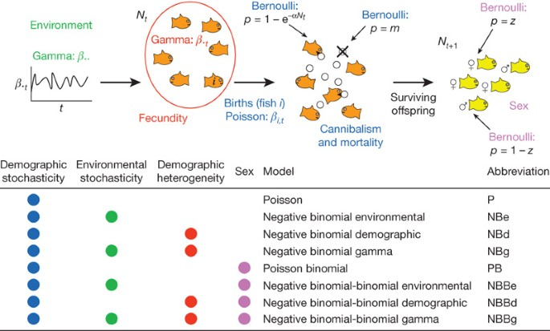
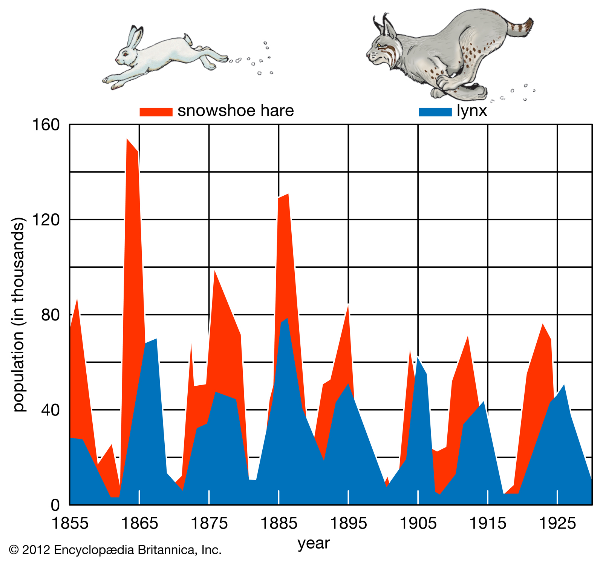
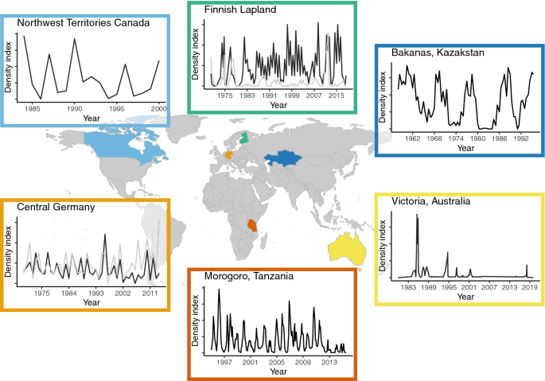

class: left, middle


```{r setup, include=FALSE}

options(htmltools.dir.version = FALSE)
knitr::opts_chunk$set(fig.align='center', echo = FALSE, out.width = '95%')

```


class: left, center, inverse

.font300[Announcements]  
+ 
+ 
+ 


---

```{r out.width='75%'}

```
https://doi.org/10.1038/nature06922


---

```{r out.width='75%'}

```


---

```{r out.width='75%'}

```
https://doi.org/10.1007/s00442-020-04810-w


---
class: largerFont

# Stochasticity

Up until this point, we have assumed that populations are controlled by population growth rate ( $r=b-d$), carrying capacity (for the logistic model), or transitions between stages (in the matrix population modeling section). But all of these assume that if these parameters can be estimated, that the populations follow the same trajectory (i.e., *deterministic*). That is, if we started with 20 identical populations, these models would assume that these populations changed through time in the exact same manner. But this isn't really what we observe in natural systems.

So how do we incorporate this variability caused by the probabilistic and whole number nature of populations (i.e., individuals come in discrete units (1,2,3...)), and environmental variability on resulting population dynamics? These forces collectively are referred to as *stochasticity*. There are at least two different types of stochasticity, .red[*demographic stochasticity*] and .red[*environmental stochasticity*].

---

# Demographic stochasticity:

.font200[The term "demographic stochasticity" appears to have been coined by the Australian theoretical ecologist Robert May in 1973. Demographic stochasticity represents the random fluctuations in population size that occur because the birth and death of each individual is a discrete and probabilistic event. The probability of birth or death applies to the individuals. In other words, an individual is either born or it is not, or an individual dies or it does not; .red[a bird can lay 2 or 3 eggs but not 2.6]. When these discrete events are probabilistic they lead to random fluctuations in population size; and the population size can no longer be projected precisely.]

---
class: largerFont

# Environmental stochasticity

A second form of stochasticity is environmental stochasticity. This form of stochasticity influences populations by changing birth and death processes of all individuals in the population across time. So demographic stochasticity introduced randomness at each time step by considering the outcome of birth or death a random variable, whereas environmental stochasticity will consider the influence of the environmental conditions on resulting birth and death. This means that a death rate of 0.1 at time $t$ may change to a death rate of 0.15 (or 0.05) at time $t+1$. By drawing birth and death rates randomly from a set of feasible values (e.g., a normal distribution), we can introduce stochasticity into population dynamics.

Unlike demographic stochasticity, environmental stochasticity is not *density-dependent* (i.e., the effect of environmental stochasticity is the same in small and large populations).

---
class: largerFont

## Dispersal

Dispersal of individuals in a population is a natural process. Dispersal is an important aspect of population dynamics can it can increase or decrease local population densities. Dispersal being defined as the movement of individuals in a way that allows gene flow (i.e., movement of an individual from one population to another). This is not a very satisfying definition without knowledge of the local population genetic structure, so we can simplify this, .red[defining dispersal as the movement of individuals beyond their normal _home range_]. The home range of an individual is the geographic area the individual typically encounters. So dispersal puts the individual in a new environment, which can beneficial for resource acquisition and mate finding. Dispersal is also necessary for sedentary organisms, as propagules (e.g., seeds) must somehow travel to suitable new conditions.

---

# Dispersal

.font200[
Dispersal can either be active or passive.

-   *Active* dispersal is when the individual (or propagule) moves to a new habitat by its own accord (e.g., a mouse moving to a new burrow).

-   *Passive* dispersal is when an individual (or propagule) moves to a new habitat with assistance from wind, water, or animal assistance (e.g., plant seeds dispersed by frugivores).
]

---

# Dispersal vs. Migration

.font200[
It is also important here to differentiate *dispersal* from *migration.* 

.red[Dispersal] is an individual-based process of movement, often involving the movement of young away from their parents (e.g., in the extreme case, seeds, in a less extreme case, squirrels). 

.red[Migration] is the movement of a large number of individuals from one place or another, usually due to climatic cues, and typically with the intention of reaching a particular breeding ground (e.g., salmon) or tracking a resource (e.g., cicadas).
]

---

# Phases of dispersal

.font180[
Regardless of the mode of dispersal, the act of dispersal involves three phases: departure, transfer, settlement. There are different fitness costs and benefits associated with each of these phases.

-   **departure**: the individual moves from the current habitat
-   **transfer**: the individual makes the journey to the new habitat
-   **settlement**: the individual establishes itself in the new habitat

So this means that dispersal isn't just the movement of an individual from one place to another, but the individual has to _survive_. This is an important distinction.
]

---
class: inverse, center, middle

## Each stage of dispersal comes with a cost, and longer distance dispersal events tend to be rare (as mortality increases with increasing dispersal distance). 

## Most dispersing organisms die, and only a few are successful.

## .red[What are the benefits of dispersal (given that they could die)?]

???

mates, better resources, get away from predation or parasitism (enemy release hypothesis)

To find and colonize new areas. Natural section will favor an individual that leaves a relatively crowded habitat and colonizes an empty one in which it can leave many descendants. In an evolutionary sense, an individual can do one of two things: stay at home and live in a suitable place but have only a few descendants (if any), or disperse and take a chance on surviving, colonizing a new habitat, and having many descendants.

---

# Dispersal as a process

.font200[

Most individuals disperse short distances, while a small number of individuals will disperse long distances. This leads to a characteristic *dispersal kernel*. 

The .red[dispersal kernel] is a probability distribution of a given individual reaching a given patch during one dispersal event. Most dispersal kernel can be modelled as a Poisson distribution.

]

---
class: largeFont

# Neutral dispersal

Neutral dispersal would suggest that all individuals have the same probability of dispersing one unit of distance. We then allow dispersal to happen probabilistically across a landscape, with each individual dispersing some number of units. By chance, a population initiated in some area will spread out in space. It is important to note that neutral dispersal can produce a dispersal kernel similar to empirical systems. 

If you have a linear landscape composed of 10 sites and we consider individuals dispersing from the far left site, probabilities of dispersal between patches are equal for all individuals, and are a function of distance. If all patches are equidistant, we have some probability $p$ of going from patch $i$ to patch $i+1$. The probability of going from patch 1 to patch 3, for instance, is $p^{2}$. The probability of going from patch 1 to patch 4 is $p^{3}$. This creates a _geometric distribution_ (as a discrete distribution) or a _negative exponential distribution_ dispersal kernel (as a continuous distribution).

Thus, neutral dispersal dynamics do capture some characteristics of dispersal in natural systems. 

---

# Informed dispersal

.font200[Informed dispersal is when individuals use information on their own density, the density of a competitor or predator, or social information to inform dispersal probability and distance. Informed dispersal can also include information on resources or habitat conditions (e.g., water availability). To link the last lecture with this one, environmental stochasticity has previously been positively related with the tendency to disperse (individuals disperse more when environmental stochasticity is higher).]

---
class: largeFont

# Variation in individual behavior

The dispersal kernel for a given population or species suggests that the probability of an individual dispersing $x$ distance is relatively predictable if we know the shape of that distribution. But this doesn't consider the influence of three important things.

First, .red[individuals may intrinsically vary] in their propensity and ability to disperse, and will vary in their dispersal distances. We can imagine that species body size, wing size, genetics, body condition, etc. will all influence both *if* the individual disperses and *how far* the individual disperses.

Second, .red[abiotic factors] can strongly influence dispersal probability (i.e., if the individual disperses) and dispersal distance.

Third, species dispersal behavior is influenced by .red[species interactions]. The obvious example would be if the individual is surrounded by predators, it may not want to disperse and risk mortality. But individual dispersal behavior can also be limited by other individuals of the same species. That is, species density influences dispersal behavior.

---

# The influence of density on dispersal behavior

.font180[
.red[*Density-independent dispersal*]: Organisms have evolved adaptations for dispersal that take advantage of various forms of kinetic energy occurring naturally in the environment. This is referred to as density independent or passive dispersal and operates on many groups of organisms (some invertebrates, fish, insects and sessile organisms such as plants) that depend on animal vectors, wind, gravity or current for dispersal.

.red[*Density-dependent dispersal*]: Density dependent or active dispersal for many animals largely depends on factors such as local population size, resource competition, habitat quality, and habitat size.

]

---

# The influence of dispersers on density

.font150[

Good dispersers may have a certain set of physiological or demographic differences relative to poor dispersers. For instance, good dispersers tend to be larger bodied (though not always), fatter, and have higher fecundity. The implications of this is that areas of new colonization may have different population dynamics relative to patches that have been colonized previously. For a species shifting its range, this suggests that populations on the range edge may contain more dispersing individuals, which have different demographic rates, resulting in changes to population-level demographics.

At the species-level, there is a well established trade-off called the .red[*competition-colonization* tradeoff]. This idea is that species that are good at colonizing new habitats (i.e., those that can effectively disperse to a new habitat) tend to be poor competitors. This leads to succession (the turnover of species over time), which we will discuss in later lectures, as these early colonizers are quickly replaced by more dominant competitors (who just aren't as good at dispersing).

]

---
class: largeFont

# Dispersal in human-modified landscapes

Things like roads and dams present massive barriers to dispersal of many organisms. We can imagine a simple case of increased mortality or decreased dispersal probability near highways (think of all the roadkill you've seen on I-10). Much like geographic barriers (e.g., mountains, rivers), human-made structures can prevent dispersal (e.g., one species of snail actually speciated, diverged into two different species, as a result of a highway being built such that the geographic distribution of the species was split into two isolated halves). Another example is the building of "green bridges" across major highways. These are elevated patches of forest that go over highways, and allow large-ranged mammals and other organisms to disperse a bit more freely. 

One the other hand, some species take advantage of human-made structures like roads. The northward expansion of the nine-banded armadillo was greatly advanced by roads, as armadillos could then walk alongside of roadways, getting over geographic barriers such as rivers. Zebra mussels are transported between lakes on the hulls of boats or through ballast water releases. Ballast water is a huge issue when it comes to the control of invasive species, as global shipping has connected areas where dispersal would never happen.

---
class:: inverse, middle, center

# Exam 1 practice questions

---
class: center, middle

### A population grows in discrete time according to the logistic growth equation. At time t, the population has 100 individuals. If k is 1000 and  is $e^2$, what is the population size at t + 1 (the next timestep)?

--

.font180[Make sure you understand all the equations, relationship between r and lambda, when the equilibrium happens, etc.]

---
class: center, middle

### Given you a life table, what is R0? What is r? What is G? (make sure you understand how to calculate this using the example we went through during the lectures)

---
class: center, middle, largerFont

Given the Leslie matrix below, what is the population size after 2 timesteps given the starting population size of J = 20, T =10, A = 60? Round to nearest whole number.

|   | J   | T   | A |
|---|-----|-----|---|
| J | 0.2 | 0.5 | 3 |
| T | 0.3 | 0   | 0 |
| A | 0   | 0.5 | 0 |


