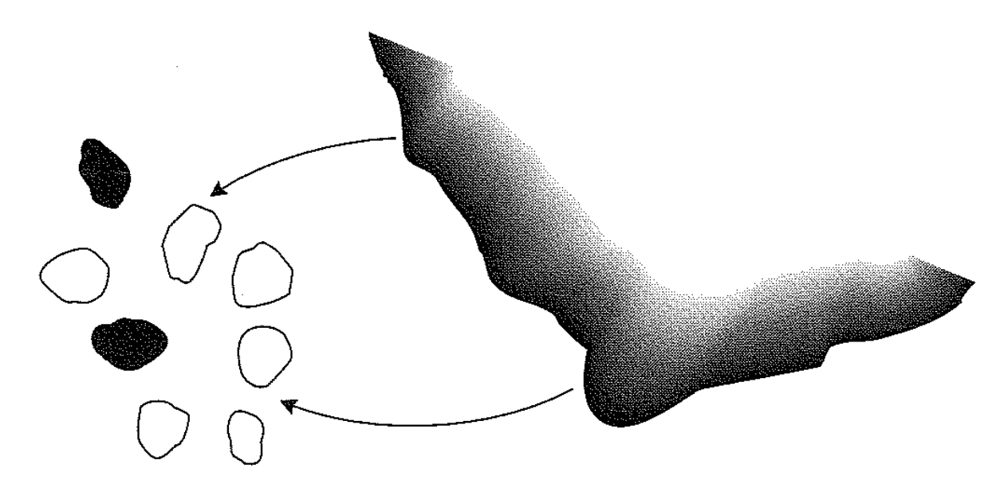
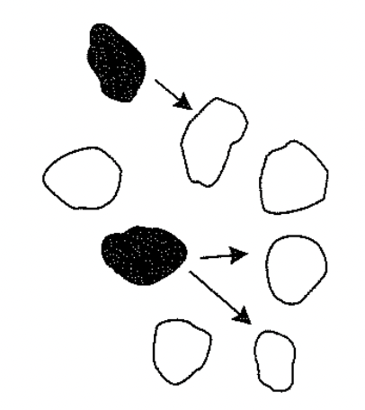

class: left, middle


```{r setup, include=FALSE}
options(htmltools.dir.version = FALSE)
knitr::opts_chunk$set(fig.align='center', echo = FALSE, out.width = '95%')
```


class: left, center, inverse

.font300[Announcements]  

## Exam 1


---

# Population dynamics so far

.font200[
- Exponential growth with unlimited resource
- Logistic growth (Carry Capacity _K_)
- Age structures
- Closed population and dispersal
]


---

# Metapopulation

### The movement of individuals among sites can be potentially important to the persistence and survival of populations.

### *Metapopulation*: population of populations (Levins 1970); a group of several local populations linked by immigration and emigration

---

# Scaling populations to landscapes

.font200[
1. No longer focus on number of individuals (i.e. population size); instead we focus on the population's .red[_persistence_] (i.e., local extinction or local persistence)

2. Shift to focus on regional and landscape level with many connected sites; we no longer focus on the persistence of any particular population; instead we try to understand the .blue[_fraction of all population sites that are occupied_]
]

???

parking lot; does not care about a specific lot, but the proportion of opening/filled lots

---

# Local vs regional extinction risk

.font200[
.red[_local extinction_]: a single population extinct

.red[_regional extinct_]: all populations in a system extinct (metapopulation die out)

]

.pull-left[

#### One population

$p_e$: probability of local extinction, e.g. $p_e = 0.7$

probability of persistence = $1 - p_e$, e.g., 0.3
]

--

.pull-right[

#### Multiple (e.g., $n = 5$) population

probability of regional extinction = $(p_e)^{n}$ = $0.7^5$ = `r 0.7^5`

probability of regional persistence = $1 - (p_e)^{n}$ = $1 - 0.7^5$ = `r 1-0.7^5`
]

--

.font150[**Spread of the risk**: a set of populations can persist for a surprisingly long time]

---

# Metapopulation models

## Assumptions

.font150[
- a set of *homogenous* pathes

- no spatial structure

- no time lags: instantaneous response

- constant colonization/immigration and extinction rates

- regional occurrence affects local colonization and extinction rates

- large number of patches
]

---
class: center, middle

# Parameter symbols in notes vs book


.font200[

|                            | Notes | Book |
|----------------------------|-------|------|
| Fraction of sites occupied | $N$     | $f$    |
| Colonization rate          | $c$     | $p_i$  |
| Extinction rate            | $e$    | $p_e$  |
]

.font150[

$p_i$: is approximately the proportion of open sites colonized per unit time

$p_e$: the probability that a site becomes unoccupied per unit time
]

---


# Metapopulation models

$$\frac{df}{dt}=I-E$$

--

$$I=p_i(1-f)$$

--

$$E = p_ef$$

--

$$\frac{df}{dt}= p_i(1-f)-p_ef$$

--

### The above equation will serve as a template for developing alternative metapopulation models.

---

# The island-mainland model

.font150[
The equation in the previous slide is the simplest model for our metapopulation with $p_i$ and $p_e$ as constants.
- $p_e$ is a constant so that the probability of extinction is the same for each population and does not depend on the fraction of patches occupied
- $p_i$ is constant implies a **propagule rain**, a continuous .blue[external] source of migrants
]

.center[]

---

# The island-mainland model


.left-column[
.font150[Equilibrium of _f_ :]
]

.right-column[
.font150[

$$\frac{df}{dt}=0=p_i(1-f)-p_ef$$

$$p_if+p_ef=p_i$$

$$\hat{f}=\frac{p_i}{p_i+p_e}$$
]
]

### Note that even with large $p_e$ and small $p_i$ (it will always be >0 because of external sources), $f$ will still > 0, i.e. at least some of the sites in the metapopulation will be occupied.

---

# Internal colonization (Levins model)

.font150[
No propagule rain and the only source of propagules for the metapopulation is the set of occupied sites, i.e., .red[internal colonization]
]

.pull-left[

]

.pull-right[
.font150[
$$\frac{df}{dt}=p_i(1-f)-p_ef$$

$$p_i=if$$

$$\frac{df}{dt}=if(1-f)-p_ef$$

]
]

---

# Internal colonization

## Find Equilibrium

.pull-left[

.font150[

1. set the equation $\frac{df}{dt}=if(1-f)-p_ef$ to 0

2. solve $f$
]
]

--

.pull-right[
.font150[
$$if(1-f)=p_ef$$

$$p_e=i-if$$

$$\hat{f}=\frac{i-p_e}{i}=1-\frac{p_e}{i}$$

]
]

.font150[
Note: if $\hat{f}\leq0$, metapopulation will go extinct because no external sources
]

---

# The Rescue Effect

.font130[
The above two models assumed that $p_e$ was a constant and was independent of $f$.

$p_e$ might be affected by $f$ because with higher $f$ there would be more propagules that leave the site and may arrive at occupied sites to increase the local population size.

This increase in local population size $N$ is a .red[rescue effect] that may prevent the local population from extinct due to demographic and environmental stochastics.
]

--

.pull-left[
.font130[
$$p_e=e(1-f)$$
$$\frac{df}{dt}=p_i(1-f)-ef(1-f)$$
]
]

--

.pull-right[
.font130[
$$p_i=ef$$

$$\hat{f}=\frac{p_i}{e}$$
]
]

---

# Neutral Equilibrium

### Internal colonization + Rescue effect

$$\frac{df}{dt}=if(1-f)-ef(1-f)$$

### Equilibrium?? No simple solution!

.font150[
- $i > e$, metapopulation grows until $f=1$ (landscape saturation)

- $i < e$, metapopulation contracts until $f=0$ (regional extinction)

- $i = e$, no change for $f$
]

---

# Types of metapopulation


---
class: center, middle

# Four metapopulation models

|                                        | Independent $p_e$             | $p_e$ mediated by rescue effect  |
|----------------------------------------|-------------------------------|----------------------------------|
| External colonization (propagule rain) | $\frac{df}{dt}=p_i(1-f)-p_ef$ | $\frac{df}{dt}=p_i(1-f)-ef(1-f)$ |
| Internal colonization                  | $\frac{df}{dt}=if(1-f)-p_ef$  | $\frac{df}{dt}=if(1-f)-ef(1-f)$  |

--

<br>

|                                        | Independent $p_e$     | $p_e$ mediated by rescue effect |
|----------------------------------------|-----------------------|---------------------------------|
| External colonization (propagule rain) | Island-mainland model | Rescue effect                   |
| Internal colonization                  | Levins model          | Neutral equilibrium             |


