class: left, middle


```{r setup, include=FALSE}
options(htmltools.dir.version = FALSE)
knitr::opts_chunk$set(fig.align='center', echo = FALSE, out.width = '95%')
```


class: left, center, inverse

# Announcements

### No error in the Notes regarding equilibrium and _r_

---

# Recap

|                                        | Independent $p_e$             | $p_e$ mediated by rescue effect  |
|----------------------------------------|-------------------------------|----------------------------------|
| External colonization (propagule rain) | $\frac{df}{dt}=p_i(1-f)-p_ef$ | $\frac{df}{dt}=p_i(1-f)-ef(1-f)$ |
| Internal colonization                  | $\frac{df}{dt}=if(1-f)-p_ef$  | $\frac{df}{dt}=if(1-f)-ef(1-f)$  |

<br>

|                                        | Independent $p_e$     | $p_e$ mediated by rescue effect |
|----------------------------------------|-----------------------|---------------------------------|
| External colonization (propagule rain) | Island-mainland model | Rescue effect                   |
| Internal colonization                  | Levins model          | Neutral equilibrium             |

---
# The Niche

## One main goal of Ecology is to explain species distribution and abundance

.font200[Ecological niche subsumes all of the interactions between a species and the biotic and abiotic environment, and thus represents a very basic and fundamental ecological concept. ]

.font200[The ability to set fundamental physiological limits for a given species (i.e., one way define the niche), allow the projection of physiological limits into geographic space to understand the potential geographic distribution of the species.]

---

# What is Niche?

.font200[
> ... the part of ecological space (defined by all combinations of biotic and abiotic environmental conditions) where the species population can persist and thus utilize resources and impact on its environment. (Polechová & Storch 2019)
]

---

# Three main approaches to the Niche

### The first approach emphasizes environmental conditions necessary for a species presence and maintenance of its population

--

### The second approach stresses the functional role of species within ecosystems

--

### The third one a dynamic position of species within a local community, shaped by species’ biotic and abiotic requirements and by coexistence with other species.

---

# The first approach to the Niche

.pull-left[
  .font150[
   Joseph Grinnell

.blue[Grinnellian Niche ≈ “Habitat”, the place a species can take in nature]

“The ultimate distributional unit within which each species is held by its structural and instinctive limitations" (1928)

The knowledge of a species niche determined by its habitat requirements is essential for understanding and even predicting its geographic distribution
  ]
]

.pull-right[
  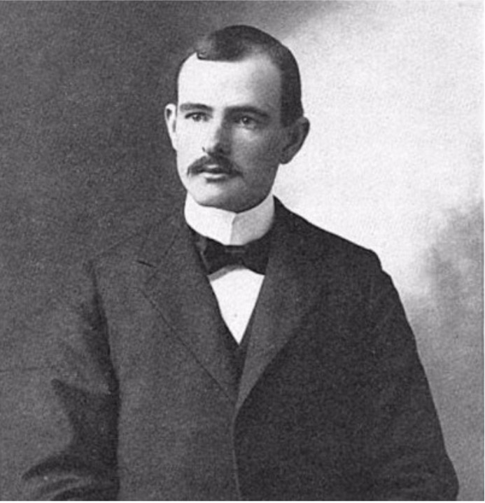
  
.font130[This concept of the niche is more relevant in biogeography and macroecology than in community or ecosystem ecology.]
]

---

# The second approach to the Niche

.pull-left[
  .font150[
   Charles Elton
   
.blue[Eltonian Niche ≈ “Profession” or “Role”; ecological function of the species]

“The status of an animal in its community … its place in the biotic environment, its relations to food and enemies" (1927) 

Each species has a particular role in an ecosystem and its dynamics, and one such role can be fulfilled by different species in different places

  ]
]

.pull-right[
  
  
.font130[This concept of the niche is more relevant in ecosystem ecology.]
]

???

Elton’s niche can apply to several species, for example, "the niche filled by birds of prey which eat small mammals".

---

# The third approach to the Niche

.pull-left[
  .font150[
   George Evelyn Hutchinson
   
.blue[Hutchinsonian Niche = “n-dimensional hypervolume” determined by a species’ requirements to reproduce and survive]

"an n-dimensional hypervolume ... defined on axes [representing] all of the ecological factors relative to [the species] ... [and] every point in which corresponds to a state of the environment which [permits] ... the species ... to exist indefinitely" (1958)


  ]
]

.pull-right[
  
  
.font130[This concept of the niche is more relevant in community ecology.]
]

???

The emphasis on the diversity of ecological communities and interspecific competition among them in the second half of the twentieth century has led to the formalization of the niche concept, and an emphasis on the properties of the niches which enable species coexistence within a habitat.

Notice that Hutchinson’s definition of the fundamental niche is a region in which the population could persist indefinitely (assuming individuals have food).  This was an important step forward in the development of the niche concept, since it brought some quantitative rigor to the concept.  The n-dimensional hypervolume is defined at the population level by the population-persistence thresholds or boundaries for conditions along each of the hypervolume’s axes (in the figure on this slide there are only 3 axes). 

---

# The Hutchinsonian Niche

.pull-left[

.font130[
- Each dimension in the niche space represents an environmental variable potentially or actually important for a species persistence

- These variables are both abiotic and biotic

- In the Hutchinsonian view, ecological niches are dynamic, as the presence of one species constrains the presence of another species by interspecific competition, modifying the position of species’ niches within the multidimensional space

]
]

.pull-right[
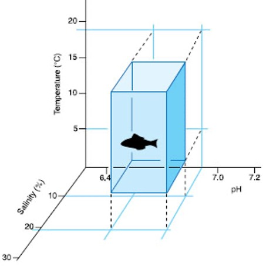
]

---

# The Fundamental vs. Realized  Niche

.pull-left[
.font150[
**Fundamental niche**: resources and abiotic requirements for the species to hypothetically survive and reproduce

**Realized niche**: fundamental niche modified by biotic interactions, etc.; it is where the organism is actually found

The “realized niche” is what Darwin referred to as the organism’s “place in the economy of nature”

]
]

--

.pull-right[
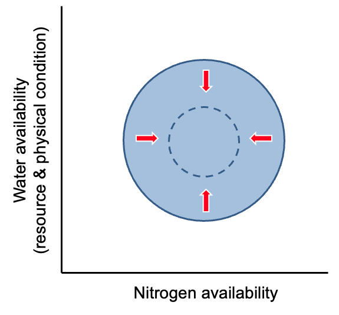
]

--

### .center[.red[Why might the fundamental and realized niches differ?]]

???


Sometimes the realized niche is smaller than the fundamental niche; in this figure the arrows represent biotic interactions that compress the fundamental niche into its realized configuration.

When Hutchinson conceived of the ideas of the fundamental and realized niches, he was thinking mostly about competition (this is one illustration of the primacy of competition as a key process during those early decades of the development of modern ecological theory).  He imagined that competition would generally reduce the conditions in which a focal species could be found and that the realized niche and empirical distribution would be the same thing. Whether or not we equate realized niche with realized distribution, many factors can modify (sometimes dramatically) where a species is actually found relative to where it could be found based on abiotic conditions along for an other well-fed population.

---

# The Fundamental vs. Realized  Niche

.center[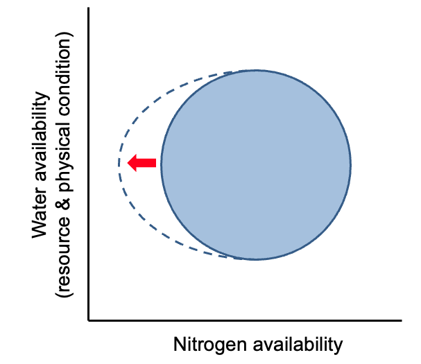]

???

Sometimes the realized niche is larger than the fundamental niche; in this figure the arrow represents biotic interactions that expand the fundamental niche into its realized configuration.  This might occur because of a mutualist or because a competitor serves as a facilitator in some part of the landscape (e.g., “nurse plants”).

---

# The consequences of the niche

.font150[Species with a larger set of abiotic tolerances should hypothetically have a larger geographic distribution, and be the strongest competitors in variable environments. This is because they are able to persist in a broader range of conditions than species with more narrow niches. This suggests that there should be a direct positive relationship between species geographic range size and climatic niche size.  
[There is](https://onlinelibrary.wiley.com/doi/full/10.1111/ele.12140).
]

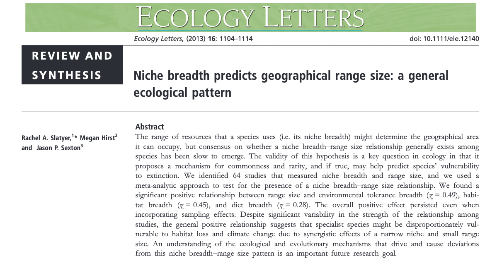

---

# Theory vs. applications

.font130[
- Straightforward theoretical consequences

- In practice it can be quite difficult to describe properly the ecological niches of real species, because the number of niche dimensions is potentially infinite, and the signifi- cant niche axes (and appropriate measurements) may be rather hard to find: a niche overlap among species may mean we did not succeed in determining the crucial niche axes of separation

- The difficulties in determining appropriate niche axes, however, still considerably limit the usefulness of the concept in empirical research. Even if we know the important resources, it is still problematic to decide which characteristics to measure

- A further problem, albeit rather technical, is posed by including discrete categories: the width of the cloud in the respective dimension would be reduced to zero, and its position can be arbitrary
]

---

# Vacant niche

.font200[The idea is that some range of environmental niche space is not being occupied, and therefore some species "should" be there to "fill" the vacant niche.

Hutchinsonian niche view would define the niche by the range of environments in which a species occurs, so it's a property of the species and not a property of the habitat.

The idea of the vacant niche treats the niche as a property of the climatic space or of a particular ecosystem. 

]

---

# Vacant niche

.font150[
An example of a vacant niche comes from Lawton and colleagues, who studied a fern species and the associated insect communities. They found a wide range of insect species on the fern plants, despite the plants being a relatively homogeneous environmental space. Thus, they argued that the plants with few species must have some vacant niches. That is, the plant contains some set of environmental space that is unoccupied by the set of species. Thus, the environmental niche space is a property of the fern, defined independently of the species niche limits. 

**What is wrong with this idea?** Apart from mis-defining the niche, this completely ignores the influence of _dispersal limitation_. Dispersal limitation occurs when a species is able to successfully disperse to a given habitat (e.g., low species richness on a fern which is a bit far away and therefore tough to disperse to). The other two things that are largely ignored in this view of vacant niches is the influence of _competitive exclusion_ and _historical contingency_. 

]

---

# Niche Overlap and Competition

.font150[
What is .red[competition]? Defined as the use or defence of a _limiting_ resource by an individual that reduces the availability of the resource to other individuals. 
]

--

.font150[

Which of the following cannot be a resource?  
a. Mates  
b. Physical space  
c. Light  
d. pH  
e. All of the above can be resources.
]


--

### The idea being that the more two species' niches overlap, the more strongly they will compete with one another.

---

.font150[
If two species consume the exact same food resource, what will happen when the two species are grown together?

a. Both species will reach their K  
b. Both species will survive at levels lower than K  
c. Both species will go extinct  
d. Only the better competitor will survive and the other species will go extinct 

]

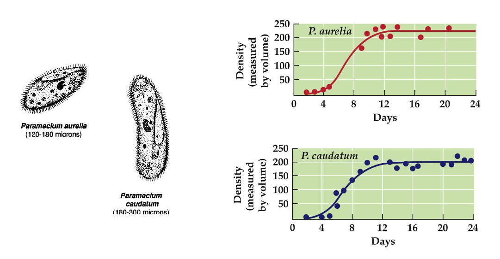

---
class: center, middle

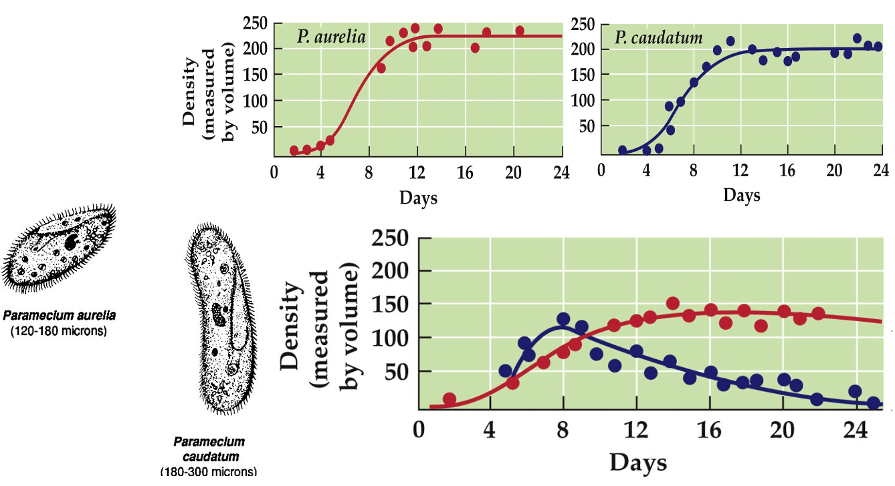

.font150[.blue[Competitive Exclusion Principle]: Complete competitors cannot coexist. Two species cannot coexist indefinitely on the same limiting resource. One will out-compete the other.
]

---

.font150[
If two species consume some similar resources but also some different resources, what will happen when the two species are grown together?

a. Both species will reach their K  
b. Both species will survive at levels lower than K  
c. Both species will go extinct  
d. Only the better competitor will survive and the other species will go extinct  
]

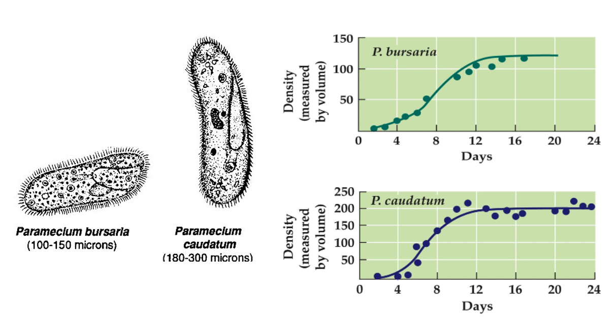

---
class: center, middle

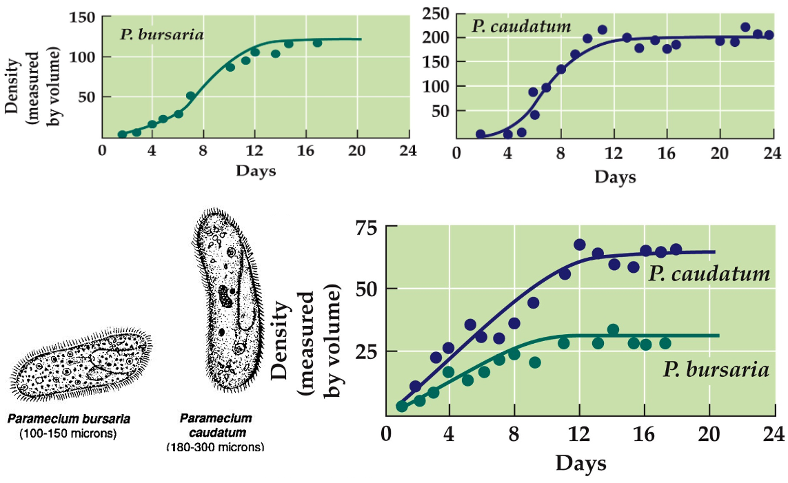

.font130[_P. aurelia_ & _P. caudatum_ ate mostly floating bacteria;   
_P. bursaria_ ate mostly yeast cells on the bottoms of the tubes
]
---

# Interspecific competition results in:

.font200[
1 .red[Competitive Exclusion]: Niche overlap is so great that one species outcompetes the other
]

--

.font200[
2 .red[Competitive Coexistence]
]

--

.font200[
2a .red[Niche Partitioning]: dividing up the resources such that each species specializes on a different aspect of the resource spectrum
]

--

.font200[
2b .red[Niche Evolution]: e.g., character displacement, an evolutionary outcome that can lead to competitive coexistence (can be morphology, behavior, or physiology)

]

---

# Spatial Niche Partitioning

.center[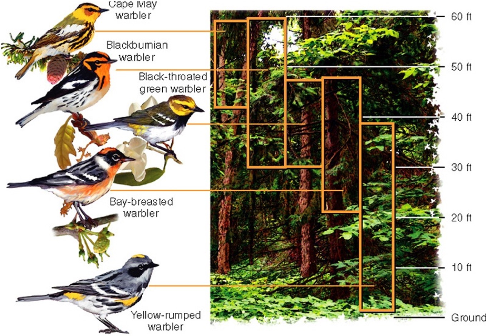]

---

# Temporal Niche Partitioning

.center[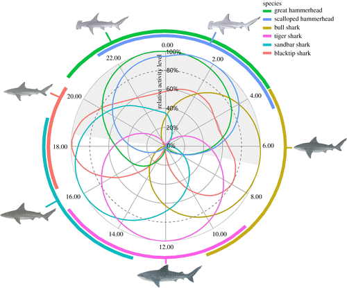

.font150[ Diel activity patterns of co-occurring shark species. [Lear et al. 2021](https://royalsocietypublishing.org/doi/10.1098/rspb.2021.0816)]]


---
class: center, middle, inverse

# Competition

.font200[
- Ecology is the study of the relationships between organisms and their environment

- Until now, we have explored many of the ways organisms affect and are affected by their environment

  + Mostly population dynamics of a single species
  
- We now turn attention to the interaction between organisms, both within and between species
]

---

# Competition

.font200[
- Negative for both parties (-/-)

  + even the "winner" will have expended more energe to gain the resource that it would have if there was no competition
  
- **Competitive interactions** are those in which two species negatively influence each other's population growth rates and depress each other's population sizes
]

---

# Competitive interactions are diverse

.font150[
- Intraspecific
- Interspecific
]

--

### By mechanisms

.font150[
- .red[Exploitation competition]: through use of a shared limited resource (e.g. food, nutrient)
- .red[Interference competition]: direct interactions between individuals that reduces the exploitation efficiency of another individual or population (e.g., aggressive defense of territories, chemical toxins [_allelopathy_])
- .red[Pre-emptive competition]: compete for space as a limiting resource (e.g., birds use tree holes)
- .red[Apparent competition]: one species indirectly influences the survival or reproduction of another species through indirect effects on a shared predator or parasite
]

---

# What makes a good competitor?

### One idea is that the winner of competition is the amount of resource necessary for the species to have a positive growth rate. This is often referred to as $R^*$ .blue[(R star) from Tilman's resource-consumer model], and can be used to explain the maintenance of species diversity in a community. The idea is that a species with a lower $R^*$ will outcompete a species with a higher $R^*$, especially as resources become limited.

.pull-left[
$$\frac{dN}{dt} = N_{j}(a_{j}R - d)$$

$$\frac{dR}{dt} = r - R\sum_{j} a_{j}N_{j}$$

$$ Equilibrium: R^{*} = \frac{d}{a_{j}} $$
]

--

.pull-right[
.font150[What form of competition is this modeling? Why might this limit the application to other systems?]
]

---

# Competition without considering a limiting resource

.font130[Recall the .red[logistic model] (growth rate is 
reduced by _intraspecific_ competition)] 

$$ \frac{dN}{dt} = rN\left(1-\frac{N}{K} \right) $$

Let's add competition to it through direct interactions and extend it to 2 species. This model is called .red[the Lotka-Volterra model]

.center[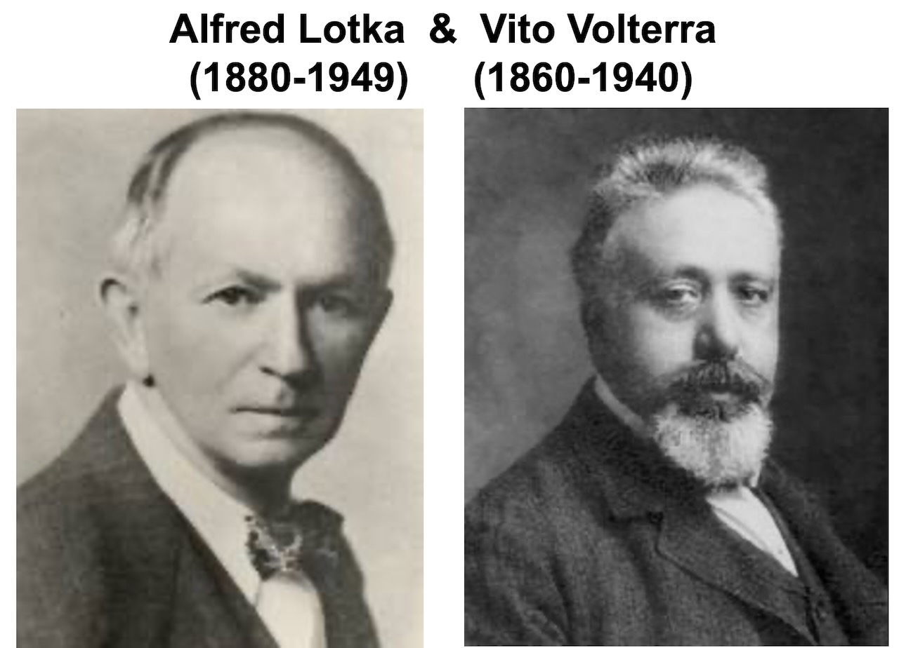]

---

# The Lotka-Volterra model

.font150[
$$\frac{dN_{1}}{dt} = r_{1}N_{1}\left(1-\frac{N_{1} + \alpha_{12}N_{2}}{K_{1}} \right)$$
]


.font150[
$$\frac{dN_{2}}{dt} = r_{2}N_{2}\left(1-\frac{N_{2} + \alpha_{21}N_{1}}{K_{2}} \right)$$
]

.font150[The competition coefficients (α<sub>12</sub> and α<sub>21</sub>) measure the _per capita_ effect of one species on the population growth of the other, measured relative to the effect of intraspecific competitio
- If α = 1, then per capita intraspecific effects = interspecific effects
- If α<sub>12</sub> < 1, then intraspecific effects are more deleterious to Species 1 than interspecific effects 
- If α<sub>12</sub> > 1, then interspecific effects are more deleterious 
]

---

# Equilibrium solutions

### set $\frac{dN}{dt}=0$

.font150[
$$\hat{N_1} = K_1 - \alpha_{12}N_2$$
]

.font150[
$$\hat{N_2} = K_2 - \alpha_{21}N_1$$
]

.font130[
This makes intuitive sense: The equilibrium for $N_1$ is the carrying capacity for Species 1 ( $K_1$) reduced by some amount owing to the presence of Species 2 ( $α_{12}N_2$)

the product $\alpha_{12}\times \alpha_{21}$ must be < 1 for $N$ to be > 0 for both species (a necessary condition for coexistence)
]

---
background-image: url('figs/state-space.jpg')
background-position: 0% 50%
background-size: contain
class: center, top

.pull-right[
# State-space graphs

.font150[
The abundance of species 1 is plotted on the x-axis and the abundance of species 2 is plotted on the y-axis

For each species within this space, there is a straight line which defines the equilibrium density of the species depending on starting conditions (i.e., the abundance of both species). These lines are called .red[zero net growth isoclines].
]
]

---
background-image: url('figs/lv_1.png')
background-position: 0% 50%
background-size: contain
class: right, top

.pull-right[.font150[
$$\hat{N_1} = K_1 - \alpha_{12}N_2$$
]]

---
background-image: url('figs/lv_2.png')
background-position: 0% 50%
background-size: contain
class: top, right

.pull-right[.font150[
$$\hat{N_2} = K_2 - \alpha_{21}N_1$$
]
]

---
background-image: url('figs/lv_3.png')
background-position: 0% 50%
background-size: contain
class: top, right

.pull-right[.font150[
Competitive exclusion of  
Species 2 by Species 1

For species 1: $K_1>K_2\alpha_{12}$ (intra > inter)

For species 2: $K_1\alpha_{21}>K_2$ (inter > intra)
]
]

---
background-image: url('figs/lv_4.png')
background-position: 0% 50%
background-size: contain
class: top, right

.pull-right[.font150[
Competitive exclusion of  
Species 1 by Species 2

For species 1: $K_1<K_2\alpha_{12}$ (intra < inter)

For species 2: $K_1\alpha_{21}<K_2$ (inter < intra)
]
]

---
background-image: url('figs/lv_5.png')
background-position: 0% 50%
background-size: contain
class: top, right

.pull-right[.font150[
Competitive exclusion with an  
.red[unstable equilibrium]

For species 1: $K_1<K_2\alpha_{12}$ (intra < inter)

For species 2: $K_1\alpha_{21}>K_2$ (inter > intra)
]
]

---
background-image: url('figs/lv_6.png')
background-position: 0% 50%
background-size: contain
class: top, right

.pull-right[.font150[
Competitive exclusion with an  
.blue[stable equilibrium]

For species 1: $K_1>K_2\alpha_{12}$ (intra > inter)

For species 2: $K_1\alpha_{21}<K_2$ (inter < intra)
]
]

---

.font150[

The carrying capacity of Paddlefish is 100 per 1km2 and the carrying capacity of Gizzard Shad is 200 per 1km2. The effect on PDFH of GZSD is 0.4, and the effect on GZSD of PDFH is 0.6. What is the expected outcome of competition, starting with 20 individuals of each species?

A. PDFH wins!	 
B. GZSD wins!	 	
C. Both go extinct 		
D. Coexistence
]


---
class: middle, center, inverse

# https://djli.shinyapps.io/lotka-volterra-competition/


---
class: middle

.font150[

>In this lake, where competitions are fierce and continuous beyond any parallel in the worst periods of human history; where they take hold, not on goods of life merely, but always upon life itself; where mercy and charity and sympathy and magnanimity and all the virtues are utterly unknown; where robbery and murder and the deadly tyranny of strength over weakness are the unvarying rule; where what we call wrong-doing is always triumphant, and what we call goodness would be immediately fatal to its possessor – even here, out of these hard conditions, … an equilibrium has been reached and is steadily maintained that actually accomplishes for all the parties involved the greatest good which the circumstances will at all permit.
>        	.right[–Stephen A. Forbes (1887)]
]
