class: left, middle


```{r setup, include=FALSE}

options(htmltools.dir.version = FALSE)
knitr::opts_chunk$set(fig.align='center', echo = FALSE, out.width = '95%')

```


class: left, center, inverse

.font300[Announcements]  
+ 
+ 
+ 


---

# Consumer-resource interactions (general predator-prey relationship)

.font200[
1. Types of predation
2. Predator-prey cycles
3. Why predators don't kill all their prey?
4. Food web
]

---
background-image: url('figs/eat.jpg')
background-position: 50% 50%
background-size: cover
class: center, top

---
background-image: url('https://upload.wikimedia.org/wikipedia/commons/2/25/Yellow_Crab_Spider.jpg')
background-position: 50% 50%
background-size: cover
class: right, bottom

# Crab spider


---

# Predation (in broad ecological terms)

.font200[
Any interaction between two species in which one is benefited and the other is harmed.

Density of one species changes the .blue[***per capita***] population growth rate of the other

Species A (_resource_) --- **.green[+]** ---> Species B (_consumer_)

Species A (_resource_) <--- **.red[-]** --- Species B (_consumer_)
] 

???

It is per captia, not necessary the population size. For example, if it is a good year with mild winter, then rabbits survival will be high, leading to a high population growth rate and the abundance of rabbits will be high by the end of summer. Foxes will take advantage of this and kill more rabbits than normal. Even though the population size of rabbits increased, the per capita population growth rate will be lower than those without foxes. 

---

# Types of predation

.font150[
A. Predator-prey (e.g., lions and wildebeests)

B. Herbivore-plant (e.g., rabbits and dandelions)

C. Parasite-host (e.g., filariasis and humans)
]

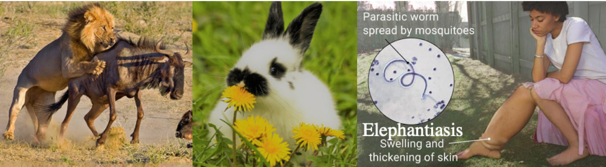

---
class: middle, center, inverse

.pull-left[
.font250[
elephantiasis  
(filarial worms)

Costs of predation and parasitism don’t have to involve death. 

]
]

.pull-right[
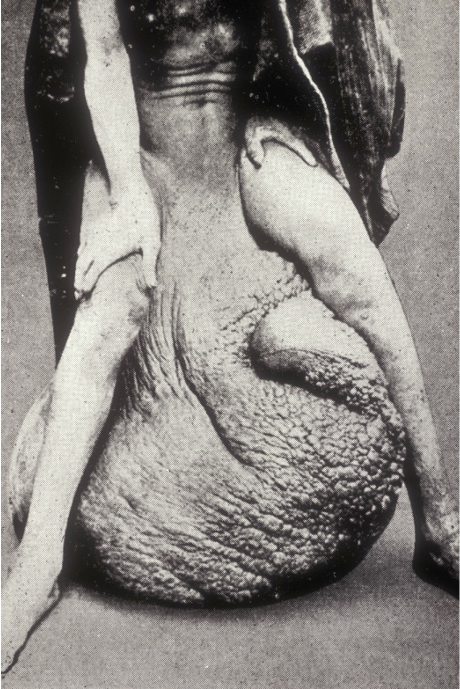
]

---
class: center, middle

## Is this a predator-prey interaction?

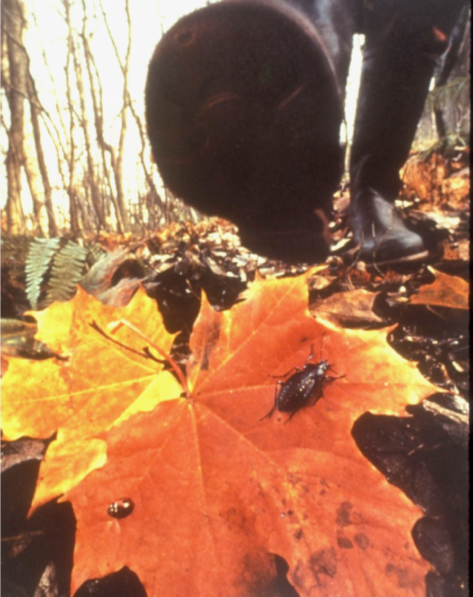


---
class: center

# Predator-prey cycles

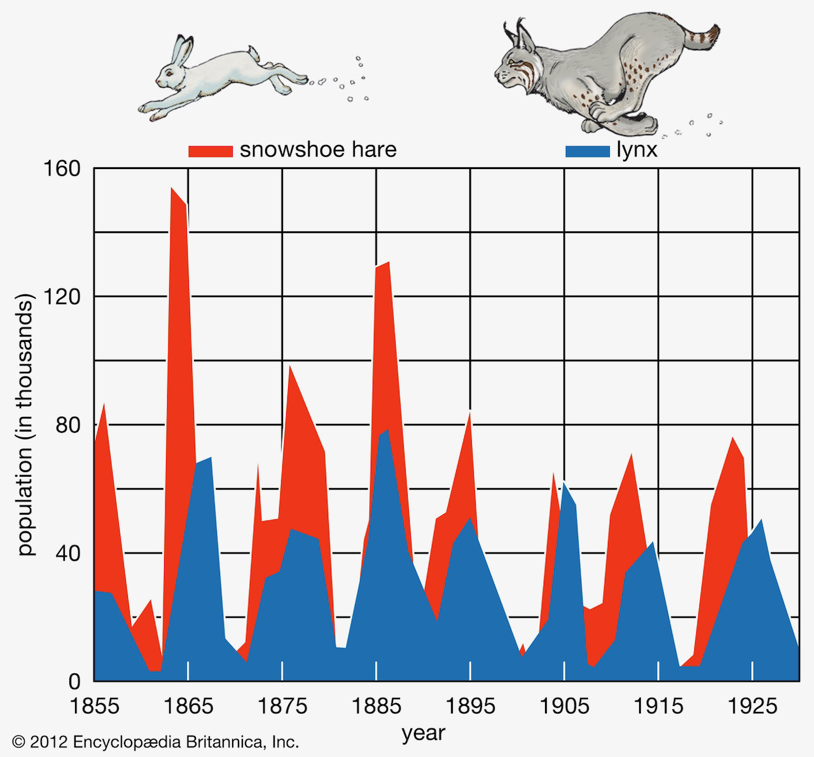

---

# Lotka-Volterra model

.pull-left[
.font200[Predator (Consumer)]

.font120[$$ \frac{dC}{dt} = -qC $$]


.font120[$$ \frac{dC}{dt} = - qC + caCR $$]

]

--

.pull-right[
.font200[Prey (Resource)]

.font120[$$ \frac{dR}{dt} = rR $$]


.font120[$$ \frac{dR}{dt} = rR - aCR $$]
]

--

.font150[
$aR$ is the .red[functional response] of the predator (rate of prey capture as a function of prey abundance); in this case linear, i.e., prey capture increases at a constant rate as prey density increases

$caC$ reflects the numerical response of the predator population – the per capita growth rate of the predator pop. as a function of the prey pop.

The consumer and resource oscillate together through time, with the consumer lagged forward in time relative to the resource dynamics.
]

???

Since the model assumes exponential growth of the prey population in the absence of predators, the model assumes that there is no intraspecific competition or other factors that operate in a density-dependent manner when predators are absent.


---

# Equilibrium


.pull-left[
.font200[Predator (Consumer)]

.font120[
\begin{align}
\frac{dC}{dt} & = caCR - qC   \\
0 & = caCR - qC \\
caCR & = qC \\
caR & = q \\
R* & = \frac{q}{ca} 
\end{align}
]
]

--

.pull-right[
.font200[Prey (Resource)]

.font120[
\begin{align}
\frac{dR}{dt} & = rR - aCR \\
0 & = rR - aCR \\
aCR & = rR \\
aC & = r \\
C* & = \frac{r}{a} 
\end{align}
]
]

--

.pull-left[
.font150[
Predator population will be stable when the number of preys equals the ratio of the predator's mortality rate and its attack times conversion rate.
]
]

--

.pull-right[
.font150[
Prey population will be stable when the number of predators equals the ratio of the prey's growth rate and predator's attack rate.
]
]

???

Predator population will increase if R* > q/ca, decrease if R* < q/ca

Prey population will increase if C* < r/a, decrease of C* > r/a

---

.font150[Suppose that rabbits are the only prey and food supply of foxes, and that the predator‒prey interaction follows Lotka‒Volterra dynamics. The mortality rate of foxes in the absence of rabbits is 0.1 per week, and the intrinsic growth rate of rabbits in the absence of predation is 0.2 per week. The capture efficiency is 0.002, and the efficiency at which rabbit biomass is converted into fox biomass is 0.2.

If there are 30 foxes in a population and 400 rabbits are present, the rate at which prey will be killed is  _______  per week.

a. 24		
b. 30		
c. 80		
d. 120	
e. 240
]

???

a

---

.font150[Suppose that rabbits are the only prey and food supply of foxes, and that the predator‒prey interaction follows Lotka‒Volterra dynamics. The mortality rate of foxes in the absence of rabbits is 0.1 per week, and the intrinsic growth rate of rabbits in the absence of predation is 0.2 per week. The capture efficiency is 0.002, and the efficiency at which rabbit biomass is converted into fox biomass is 0.2.

If there are initially 30 foxes and 400 rabbits, the overall rate of change in the rabbit population will be a _______ of _______ per week.  

a. loss; 24	 
b. loss; 16		
c. gain; 16		     			
d. gain; 56		
e. gain; 80
]

???

d

---

.font150[Suppose that rabbits are the only prey and food supply of foxes, and that the predator‒prey interaction follows Lotka‒Volterra dynamics. The mortality rate of foxes in the absence of rabbits is 0.1 per week, and the intrinsic growth rate of rabbits in the absence of predation is 0.2 per week. The capture efficiency is 0.002, and the efficiency at which rabbit biomass is converted into fox biomass is 0.2.

If there are initially 30 foxes and 400 rabbits, the net growth rate in the fox population will be a _______ of _______ per week.  

a. loss; 3		
b. loss; 1.8	 
c. gain; 1.8	     
d. gain; 4.8	 
e. gain; 6
]

???

c

---
class: center

## Predator-prey models predict stable limit cycles

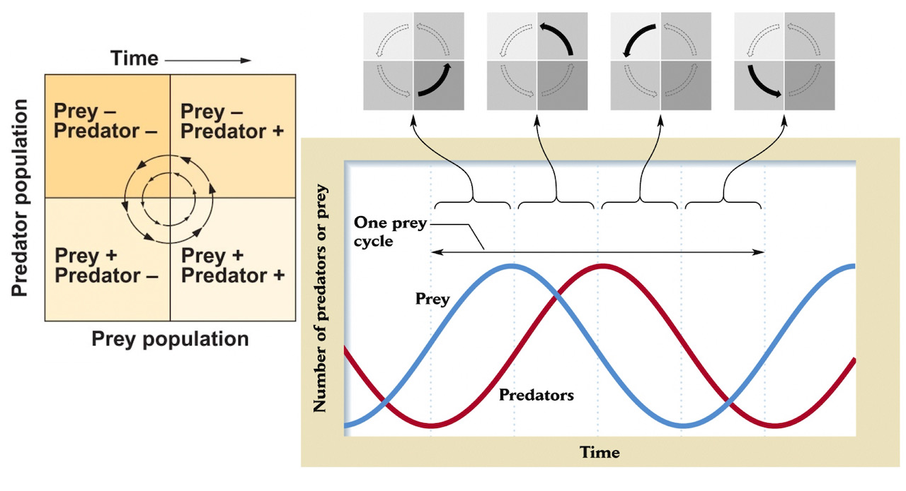

.font150[The predator and prey populations have an inherent tendency to cycle because they reciprocally depend on one another’s population size]

???

Notice how the predator population trajectory follows the prey population trajectory, with a time lag

---

<!-- # Empirical examples? -->

<!-- - Snowshoe Hares and Lynx -->
<!-- - Huffaker's mite experiments -->
<!-- - Parasitoid-host cycles -->

# Model assumptions

.font200[
- Resource population only limited by predator

- Predator (_C_ ) only eats the one resource _R_

- Individual predators consume infinite number of _R_

- Encounter of predator _C_ and resource _R_ is random and "well-mixed" (homogenous habitats)
]

---
class: middle

.font200[
In which of the following are you most likely to observe population cycles?

a. a predator that only eats one prey species  
b. a predator that eats many prey species  
c. a predator with a very high birth rate  
d. a predator with a very high death rate

]

---

# How can we make the L-V model more realistic?

.font120[ Individual predators consume infinite number of _R_]

.center[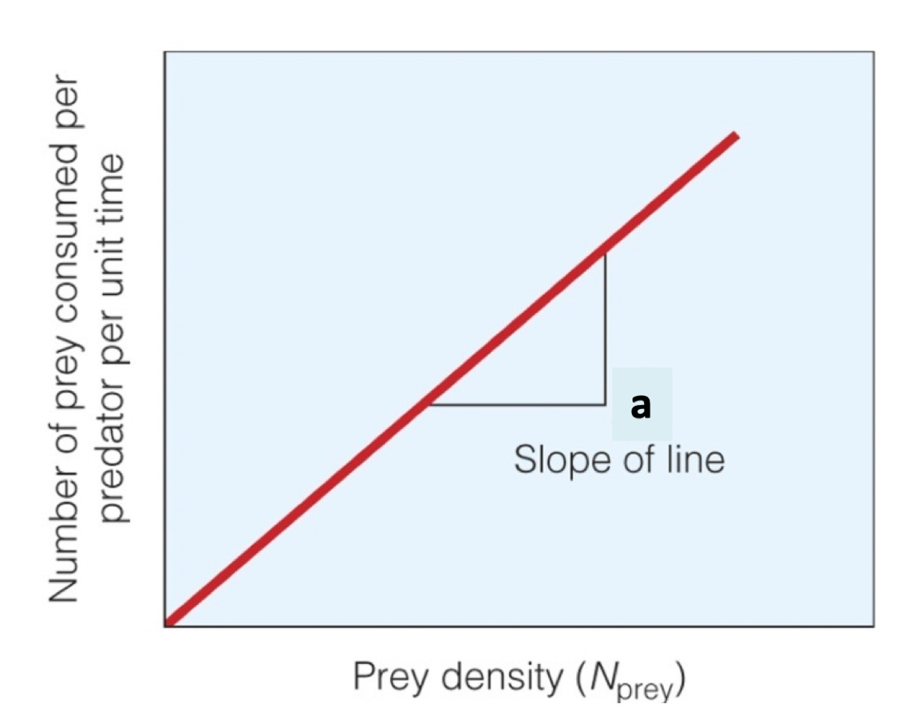]

--

.font150[Type I _functional response_ (relationship between the density of prey and an individual predator's rate of resource consumption)]


---

# Functional response types

```{r figtypes, out.width='90%'}
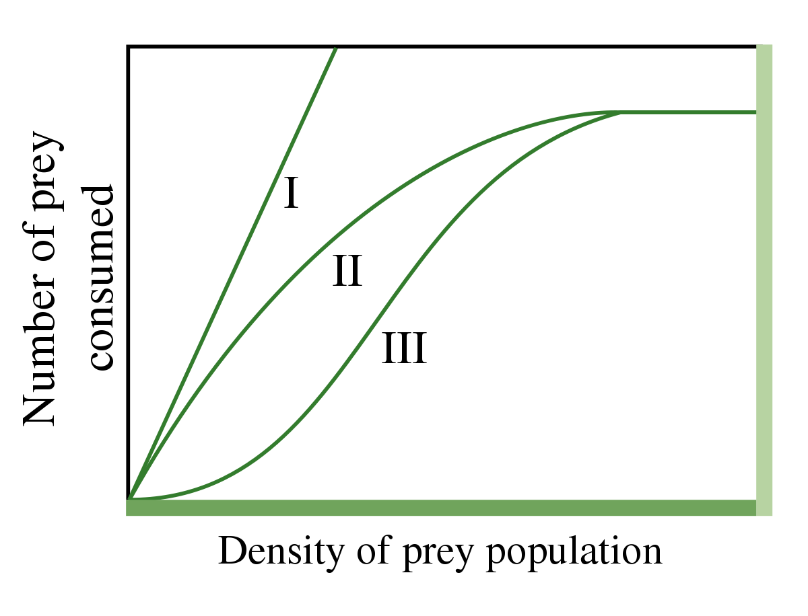
```

---

# Why predators don't kill all their prey?

--

.font200[Because this would cause their own extinction?]

--

.font200[Or even further, some may say that the predators actually act in the best interest of the prey by removing the "old and sick."]

--

.font200[.red[Wrong!] Because predators do not act this way, nor should they.]


???

Predators faced with the choice between killing prey and starving, or having their offspring starve, should always kill the prey.

---
background-image: url('figs/prime.png')
background-position: 80% 100%
class: right, middle, inverse

.pull-right[
<br>

<br>

<br>

## .blue[Why predators don't kill all their prey?] .red[Because they can’t.]
] 


---

# Why predators don't kill all their prey? .red[Because they can’t.]

.font200[1 Prey defense]

.pull-left[
```{r figdefense}
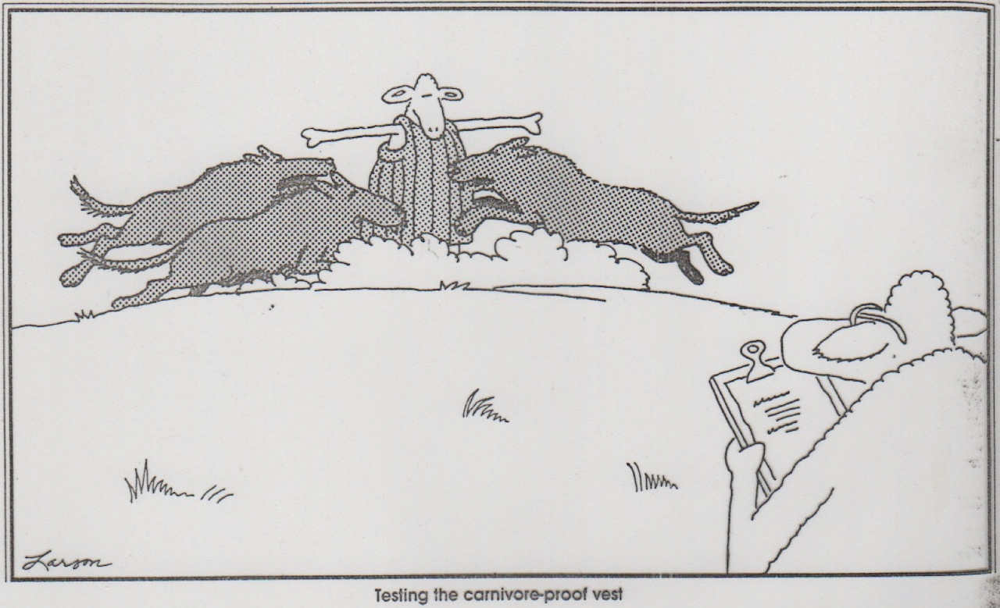
```
 
.center["Testing the carnivore-proof vest"]
]

.pull-left[
```{r figdefense2, out.width='70%'}
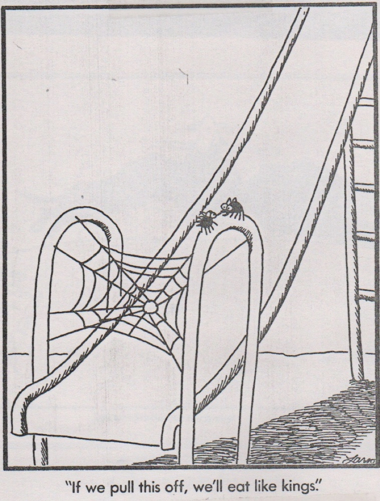
```
 
.center["If we pull this off, we'll eat like kings."]
]

---
background-image: url('https://upload.wikimedia.org/wikipedia/commons/7/72/Igel.JPG')
background-position: 50% 50%
background-size: cover
class: left, bottom, inverse

# Hodgehog

---
background-image: url('figs/pronghorn.jpg')
background-position: 50% 50%
background-size: cover
class: left, top

# Pronghorn

---
background-image: url('https://upload.wikimedia.org/wikipedia/commons/d/d6/Variable_ring_patterns_on_mantles_of_the_blue-ringed_octopus_Hapalochlaena_lunulata.png')
background-position: 50% 50%
background-size: contain
class: center, top

# Blue-ringed octopus (Australia - poisonous - fatal with one bite)


---

# Why predators don't kill all their prey? .red[Because they can’t.]

.font200[1 Prey defense]

.font200[2 Complex habitats]


```{r fighabitat, out.width = '60%'}
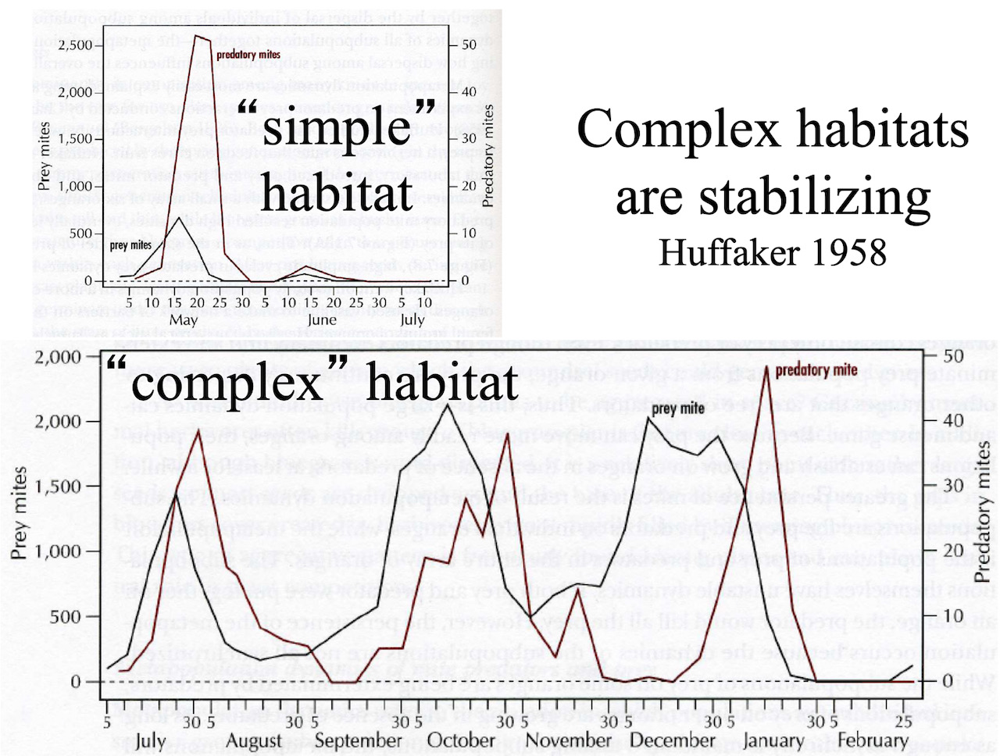
```

---

## Huffaker’s mites – predator-prey cycles in the lab

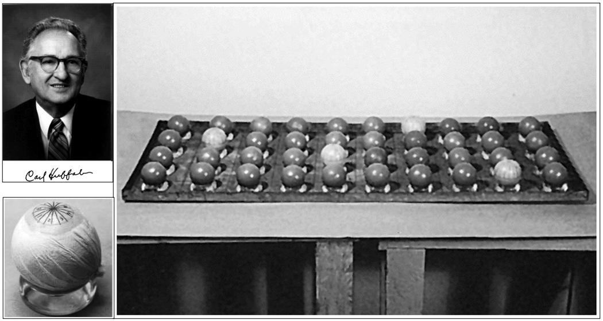

### Carl Barton Huffaker (1954)


???

this is a classic experiment - is a predator-prey relation between two species of mites - one species eats oranges - so population just builds up on same orange - other species eats the first species - orange is site of subpopulation

---
class: center, middle

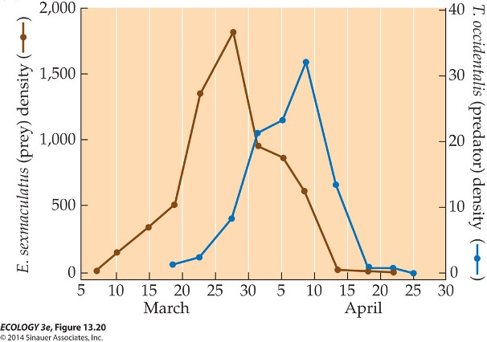

.font150[These are results when there are 20 oranges organized in a cage in such a way that both species of mites could move freely among the oranges]

---

# "Complex" habitat

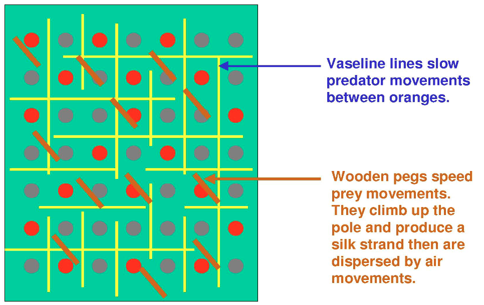


---

# "Complex" habitat

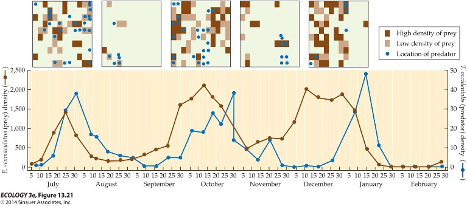

.font150[Vaseline barriers around oranges created prey refuges;  
herbivorous mites could balloon - via silk strands - among oranges;  
predators & prey coexisted with coupled, cyclical dynamics
]

---

# Why predators don't kill all their prey? .red[Because they can’t.]

.font200[1 Prey defense]

.font200[2 Complex habitats]

.font200[3 Predators have their own predators]

---
background-image: url('figs/pred.png')
background-position: 100% 50%
background-size: contain
class: inverse, middle, center

.pull-left[
# Predators have their own predators
]


???

The density of sp B can’t get high enough to drive sp A extinct because of sp C.

---

# Food web

```{r figfoodweb}
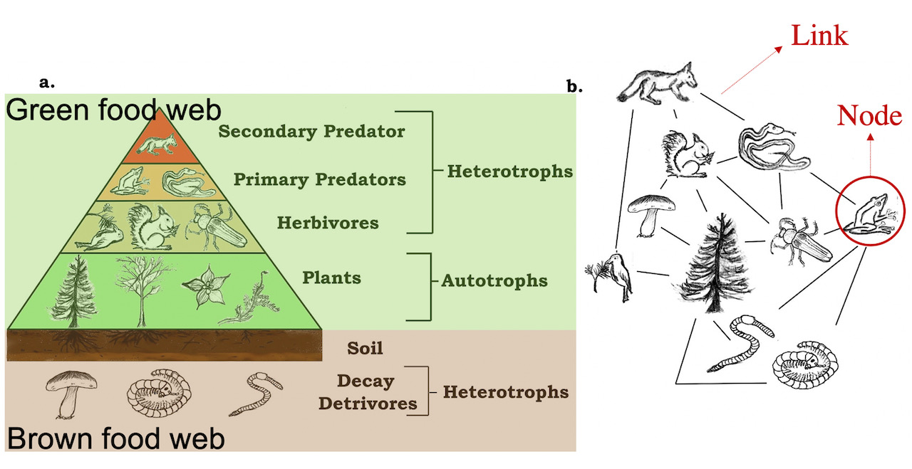
```

---

# Types of food webs

.font200[
- .blue[Connectedness food web]: feeding relationships, as described above. This is the most common type of food web

- .blue[Energy flow food web]: defines connections as dominant sources of energy transfer. So this removes some feeding links which don't contribute strongly to the conversion of biomass up trophic levels

- .blue[Functional food web]: tracks influence of populations on growth rates
]


---

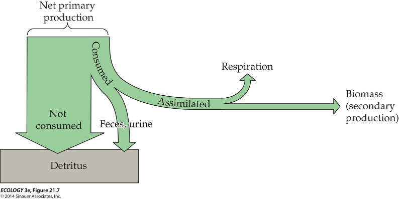

### All organisms are either consumed or enter the detritus pool (the ultimate fate of all)

.font150[In most ecosystems, most NPP becomes detritus without passing through a heterotroph]


---

# What controls food webs?

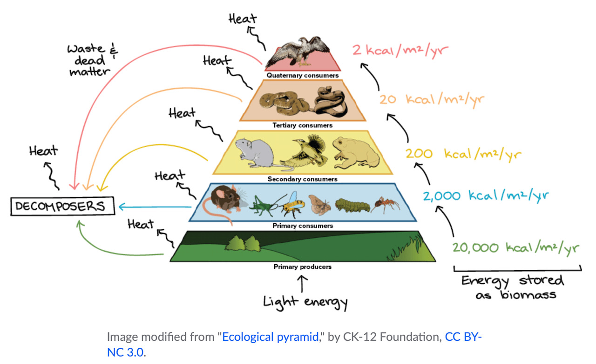

.font120[Energy; disturbance; ecosystem size; etc. Consequently, food chains tend to have < 5 trophic levels]

---

# Pyramid structure

.center[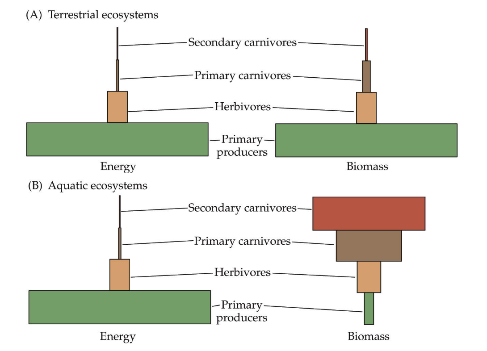]

.font150[This occurs when the demographic turn-over rates
are especially high in the producer tier of the food web; 
standing crop biomass is relatively low, but productivity is very high
]

---

# Pyramid structure

.center[]

.font200[.red[Could an energy pyramid ever be inverted?]]

---

# Trophic cascades

### Changes in abundances of organisms at one trophic level can influence energy flow at multiple trophic levels

.pull-left[
.font150[
- Top-down
- Bottom-up
]

```{r figdeer, out.width = '100%'}
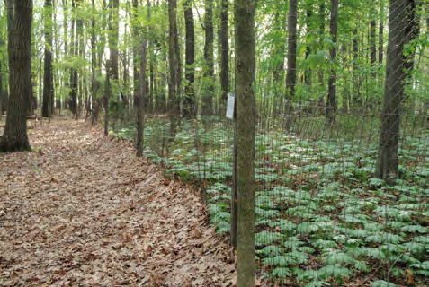
```
Benefits to humans of removing a top predator << damage inflicted by a mesopredator/herbivor that become more abundanct after the top predator declines.
]

.pull-right[
```{r figcascade, out.width = '80%'}
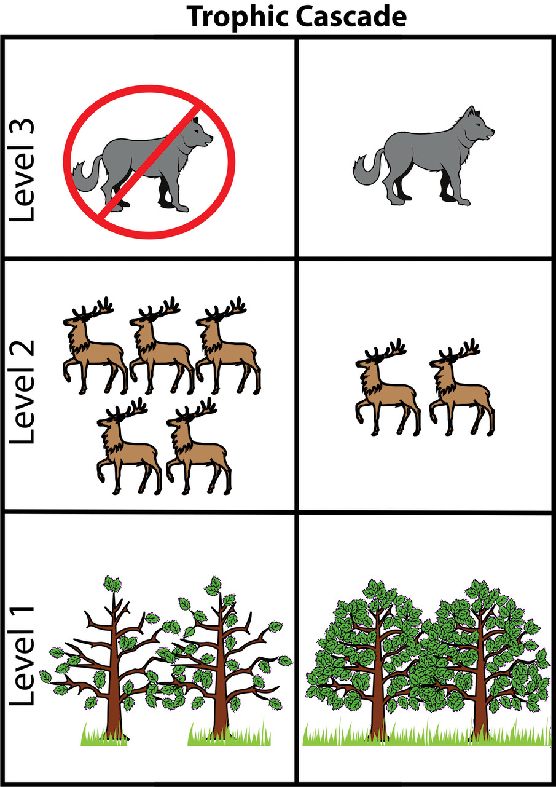
```
]

---
class: center, middle
# Question

## .red[Do clear predator-prey cycles occur frequently in nature?]
