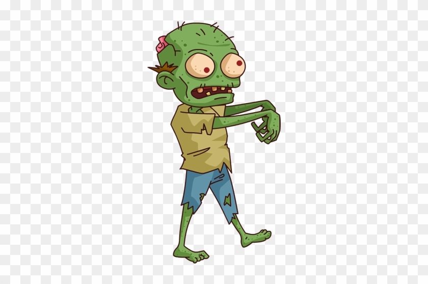
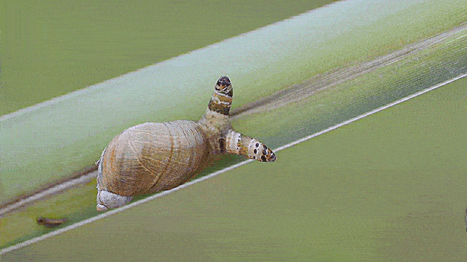
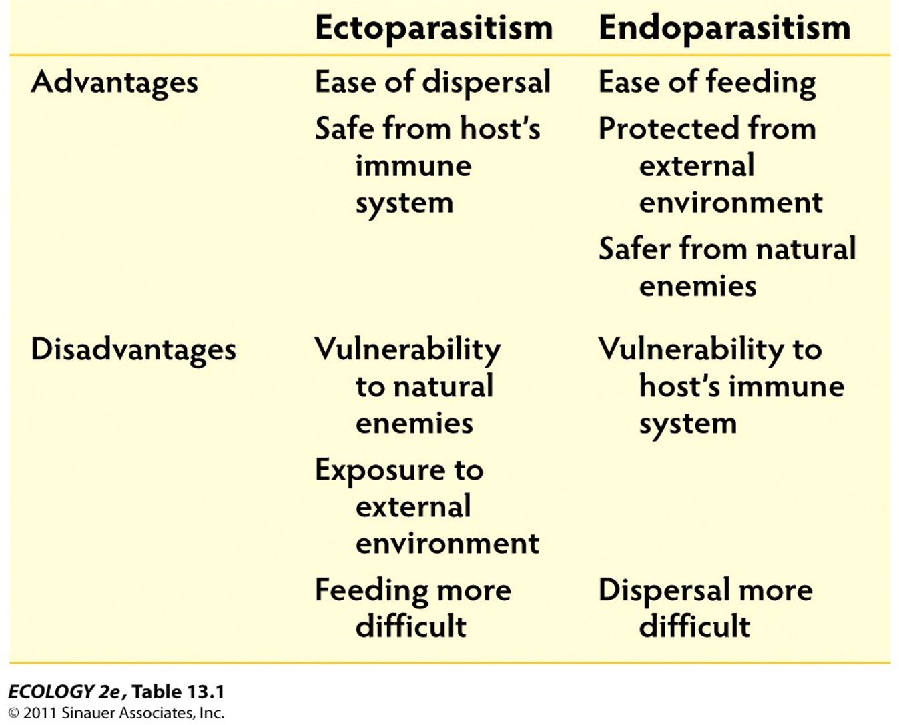
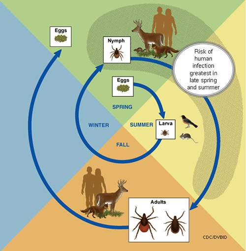
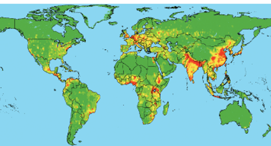
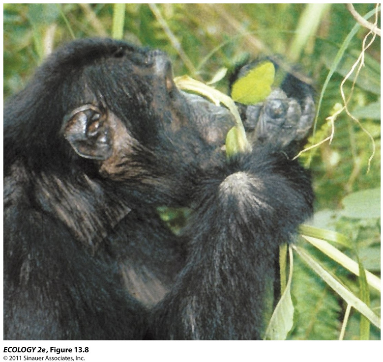
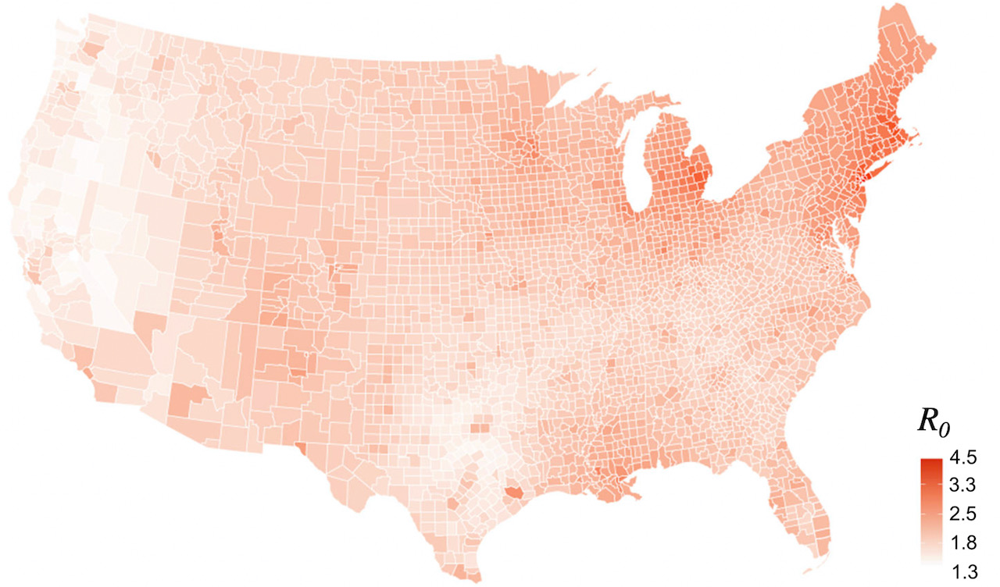
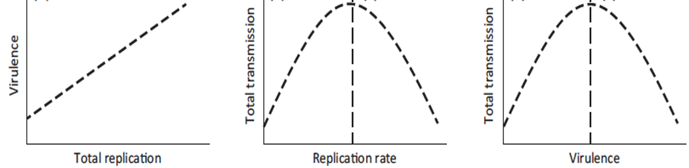
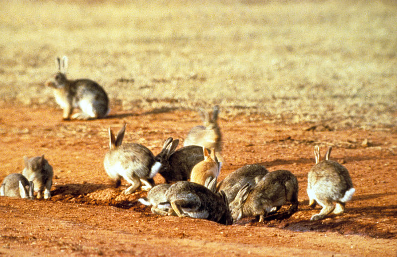

class: left, middle


```{r setup, include=FALSE}

options(htmltools.dir.version = FALSE)
knitr::opts_chunk$set(fig.align='center', echo = FALSE, out.width = '95%')

```


class: left, center, inverse

.font300[Announcements]  

+ .font200[Final project!!]
+ 
+ 

---

background-image: url('figs/covid.png')
background-position: 50% 50%
background-size: contain
class: center, middle, inverse

# .font200[Pandemic]

---


# Parasite-Host Interactions 

.font200[
1. Effects of parasites
2. Types of parasites
3. Modeling parsite-host interactions
4. Parasite-host coevolution
5. Disease spread
]

---
class: center, middle


.pull-left[

### Zombie Movies
]

--

.pull-right[


### [Zombie in nature: article](https://www.wired.com/2014/09/absurd-creature-of-the-week-disco-worm/)
]

---
class: middle, center

<iframe width="1200" height="498" src="https://www.youtube.com/embed/Go_LIz7kTok" frameborder="0" allow="accelerometer; autoplay; clipboard-write; encrypted-media; gyroscope; picture-in-picture" allowfullscreen></iframe>

---

# Parasite, pathogen, infection, and disease

.font200[.red[parasite]: an organism that lives in or on another organism (.green[host]) and causes .blue[harmful] effects (sometimes suffering, even excruciating misery, but not _immediately_ causing death) as it consumes resources from the host.]   .font150[(consumer-resource)]

--

.font200[When parasites colonize a host, that host is said to harbor an .red[infection]]

--

.font200[Only if that infection gives rise to symptoms that are clearly harmful to the host should the host be said to have a .red[disease], e.g., COVID-19]

--

.font200[.red[Pathogen]: any parasite that causes a disease (i.e. is ‘pathogenic’), e.g., SARS-CoV-2]


???

though infection by a pathogen does not always result in an infectious disease; asymptomatic

---

# Parasites are diverse

### Pretty much every organism of living thing has one or more parasite, including parasites (_hyperparasite_)

--

### Many parasites are host-specified or at least have a limited range of hosts (_specialists_); few has a broad range of hosts (_generalists_)

--

### The conclusion seems _unavoidable_ that .red[more than 50%] of the species on the earth, and many more than 50% of individuals, are parasites


---

# Effects of parasites

### Large toll on people: >25% human deaths are caused by infectious disease; 100 million people died in 1918 (the Great Influenza Pandemic caused by H1N1 virus); >2 million deaths caused by COVID-19 so far

### On wildlife: bird flu; chytrid fugus caused extinctions of amphibian species; white-nose syndrome for bats

### On plants: crops (e.g., wheat rust), trees (e.g., chestnut blight, dutch elm disease)

???

american chestnut trees used to be >50% of trees in temperate forests; now they are rare since the introduce of chestnut blight around 1900 from Asian

---

# Types of parasites

.font130[
- By location 
  + .blue[ectoparasites]: live on the outside of organisms (e.g., ticks, mites, lice, fleas, mistletoes) 
  + .blue[endoparasites]: live inside organisms (e.g., virus, cestode), often cause diseases
]

.center[]

---

# Types of parasites

.font130[
- By location 
  + .blue[ectoparasites]: live on the outside of organisms (e.g., ticks, mites, lice, fleas, mistletoes) 
  + .blue[endoparasites]: live inside organisms (e.g., virus, cestode), often cause diseases
]

.font130[
- By size
  + .blue[microparasites]: small and often intra-cellular, reproduce directly within host and are often extremely numerous (e.g., virus, some types of bacteria and protists)
  + .blue[macroparasites]: larger, live on or within a host (in cavities such as the gut or inter-cellular), do not reproduce in their host (e.g., helminth worms in an intestine, some types of fungi, bacteria and protozoa)
]

--

.font130[
- By transmission mode
  + .blue[horizontal]: move between individuals other than parents and offsprings
  + .blue[vertical]: transmitted from a parent to its offspring
]

???

tradeoffs: exposure to natural enemies, external envi, difficulty to move among host, ease of feeding on hosts

---

# Why be a parasite?

.pull-left[
## It’s a Beautiful Life!

.font200[
- Your host does it all: 
- Searches for food!
- Escapes Danger!
- Makes a cozy, steady environment!
]
]

.pull-right[
## The Result: 

.font200[
- Bathed in Ambrosia!	
- No need for limbs, most organs, etc…
- All you really need to do is suck up nutrition and reproduce!
]
]

--

### BUT – if being a parasite were _that easy_, we would all be … 

---

# Challenges to the parasitic lifestyle

.pull-left[

.font150[
1. Host defenses
2. Successfully finding the right host: 
Hosts are usually: 

  - Bigger than you, but, 
  - Much more mobile, and
  - Pretty sparse. 
]
]

.pull-right[
### All of this selects for:

.font150[
1. Adaptations to maximize a complete life cycle: Getting yourself or your progeny back to the right host
2. In particular, Complex Life Cycles: choose hosts that will tend to encounter one another or put you in the right place at the right time. 
]
]

---
class: center

# Parasite life cycle complexity



---

# The parasite niche

### Multidimensional space of tolerances and requirements of a species (abiotic and biotic)

### Niche --> understand and predict geographic distribution

### Niche --> understand host range and predict host switching; _spillover_ if the host switching involves the ability to infect a human host

.font130[
- the Great Influenza Pandemic in 1918 (H1N1 virus from birds)
- HIV (virus from chimpanzees)
- SARS in 2003 (SARS-CoV from bats?)
- COVID-19 (SARS-CoV-2 from ?)
]

---
class: center

# Spillover Hotspots



Jones et al. 2008. Nature. 451:990

.font150[Emergence of zoonotic diseases from bringing human 	beings into closer contact with reservoir species]


---

# Hosts as habitats

.font130[Hosts as reactive environments: resistance, recovery, and immunity]

.center[
 
]

.font130[Chimpanzees infected with nematodes seek out and eat a bitter plant that contains chemicals that kill or paralyze the nematodes: Self-medication is not just for humans]

???


---

# The consequences of host reaction: S-I-R

## .red[S] : susceptible individuals

## .red[I] : infectious individuals

## .red[R] : recovered (and immune) individuals

### .blue[Costs of parasitism don’t have to involve death.]

---

# S-I-R model

.pull-left[
.font150[
\begin{align}
\frac{dS}{dt} & =  -\beta SI \\
\frac{dI}{dt} & =  \beta SI - dI \\
\frac{dR}{dt} & =  dI
\end{align}
 ]
]

--

.pull-right[]

---

# S-I-R model

.pull-left[
.font150[
\begin{align}
\frac{dS}{dt} & =  -\beta SI \\
\frac{dI}{dt} & =  \beta SI - dI \\
\frac{dR}{dt} & =  dI
\end{align}
 ]
]

.pull-right[
## Model assumptions

.font150[
- A well-mixed population
- Same susceptibility for every individual
- No births of new susceptible individuals
- Permenant immunity after recovering
]
]

---

# $R_0$

.pull-left[
.font150[
\begin{align}
\frac{dS}{dt} & =  -\beta SI \\
\frac{dI}{dt} & =  \beta SI - dI \\
\frac{dR}{dt} & =  dI
\end{align}
 ]
]

.pull-right[
.font150[
$\frac{dI}{dt}>0$ only if $\beta SI > dI$

$R_0 =  \frac{\beta SI}{dI} = \frac{\beta S}{d}$

$\frac{1}{d}$: the average duration of infection
]
]

--

### $R_0$: .green[the number of secondary infections generated by a single infected individual in a wholly susceptible population]

### It provides a powerful framework for exploring the dynamics and control of epidemics

---

# $R_0$ of COVID-19 by 23 May, 2020

```{r}

```

Ives and Buzzuto, 2021 
https://www.nature.com/articles/s42003-020-01609-6

---

# How do we reduce $R_0$?

.font200[$$R_0 = \frac{\beta S}{d}$$]

.pull-left[
.font150[
- $d$ ?
- $\beta$ ?
- $S$ ?
]
]

--

.pull-right[
.font150[Vaccination: what fraction of population to achieve _herd immunity_?]

$R_0 = \frac{\beta S (1 - c)}{d} < 1$

$c > 1 - \frac{d}{\beta S} = 1 - \frac{1}{R_0}$
]

--

### If $R_0$ of COVID-19 is 4, that means we need to vaccinate  75% of population to control the pandemic

---

# Evolution of host-parasite systems

### Natural selection has favored the evolution of .red[parasite offenses] and .blue[host defenses] 

### Parasite should optimize the trade-off between virulence and transmissibility (Ebola – highly virulent but not highly transmissable)




???

First, increasing within-host parasite replication increases virulence (A); second, increasing within-host parasite replication increases the number of parasite transmission events over the duration of the infection (B), until a point where increasing parasite replication reduces the infectious period (e.g., by killing the host and preventing transmission) (C); and third, increasing parasite virulence increases parasite transmission (D) until high virulence shortens the infectious period, thereby reducing transmission (E) 


---

# Evolution of host-parasite systems

### Natural selection has favored the evolution of .red[parasite offenses] and .blue[host defenses] 

### Parasite should optimize the trade-off between virulence and transmissibility

### Hosts also evolve, but typically slower than parasites, producing arms races between hosts and parasites

### The .red[Red Queen Hypothesis] predicts a continuing evolutionary battle between parasites and hosts, not a stable equilibrium

---

# Evolution of host-parasite systems: rabbits and myxoma virus

```{r, out.width='60%'}

```


> .font130[The wild rabbits started to resist the virus, the virus started to kill them in a new way, and neither side gained any ground. “It’s like a duck in a stream, paddling like crazy under the water and not getting anywhere,” says Read.]

[The Next Chapter in a Viral Arms Race](https://www.theatlantic.com/science/archive/2017/08/rabbit-virus-arms-race/536796/)  
[Next step in the ongoing arms race between myxoma virus and wild rabbits in Australia is a novel disease phenotype](https://www.pnas.org/content/114/35/9397)  
[Seventy years ago, humans unleashed a killer virus on rabbits. Here's how they beat it](https://www.sciencemag.org/news/2019/02/seventy-years-ago-humans-unleashed-killer-virus-rabbits-heres-how-they-beat-it)

???

In 1859 European rabbits were introduced to Australia, exponential growth of rabbits

In 1950, the government released a virus known as _Myxoma_ to control rabbits. It kills an infected rabbit in 48 hours, with 99.8% killing rates.

Second breakout: 90%; third breakout: 40-60%; ... 6th breakout: 20%

rabbit populations rebound, virus persist


---

# Disease spread

## Environmental controls disease spread

.font200[
- Environment influences transmission process

- Environment affect the growth of pathogen within a host and the host

- Environment affect host or vector behavior

  + Host behavior: social contact networks
]

---

# Global environmental change and disease spread

.font200[
- Land use change

- Climate change

- Species invasion

- Community composition and biodiversity
]

---
background-image: url('figs/covid.png')
background-position: 50% 50%
background-size: contain
class: left, middle, inverse

## .red[How does this lecture help you in]
## .red[understanding the current pandemic?]
