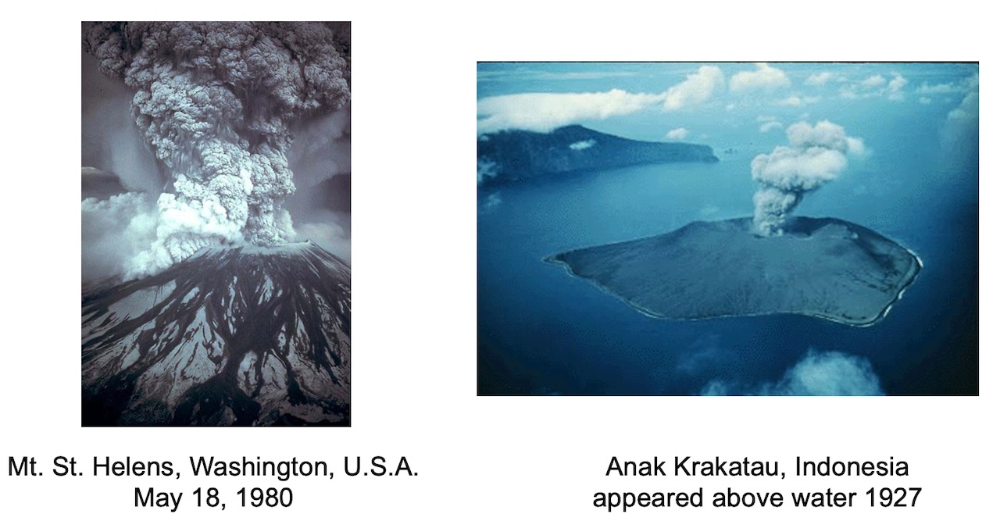

class: left, middle


```{r setup, include=FALSE}

options(htmltools.dir.version = FALSE)
knitr::opts_chunk$set(fig.align='center', echo = FALSE, out.width = '95%')

```


class: left, center, inverse

.font300[Announcements]  
+ 
+ 
+ 

---
class: center, middle, inverse

.font200[
Even though I have separate sections on Competition and Predation in the course, I don't have one on Mutualism. Mutualism is important ecologically, but often each mutualism is important for a different reason. Mutualisms are often very specific for the types of organisms that are involved. .cyan[Because mutualism is caused by co-evolution, a lot of them have their own idiosyncrasies that don't generalize easily to a way of explaining the overall things that are common to mutualisms]. This is a contrast to Competition and Predation where there are a lot of features common to the interactions between very different pairs of species.
]

---

# Levels of organization in Ecology


---

# What is an ecological community?

Community – collection of species that occur at the same place & time, circumscribed by natural (e.g., serpentine soil), arbitrary, or artificial (e.g., 1-m2 quadrat) boundaries


???

An ecological community is a set of interacting species which utilize the same environment.

---

# What is an ecological community?

Community – an association of .blue[interacting] species inhabiting a defined area whose interactions can be + or - & direct or indirect.


---

# Community Ecology

## Major focus

.font200[
- How are groupings of species distributed in nature? (e.g., diversity)

- How are these groupings explained by the environment and the interactions between and among species?
]


---
background-image: url('../13_macroecology/figs/ldg.jpeg')
background-position: 50% 50%
background-size: contain
class: center, top, inverse

# Biodiversity

---

# Calculating Biodiversity

### There are multiple ways to calculate biodiversity:

.font200[
- Species diversity
- Genetic diversity
- Ecosystem diversity
]

---

# Species diversity

.font200[alpha, beta, and gamma diversity]


---

# Measuring alpha species diversity

.font150[One of the most common measurement is .blue[species richness], the number of species in a community]


.font150[.red[What is the species richness for both communities?]]

---

# Species Richness

.font200[
Impossible to count all species

.red[Need to estimate based on sampling (quadrats, plots, transects, traps, etc.)]

Richness depends on number of samples	collected

.red[More samples → more species]
]

---

# Species Richness


---

# Species Richness

.center[


]

.font150[
Use extrapolation to predict richness

- Want to predict the asymptote
- Try to collect as few samples as possible
]

???

- with a few samples, you collect mostly common species
- with more samples, you start to collect some of the rarer species
- only with intensive sampling do you start to collect all species
- unless you’ve sampled enough to reach this plateau, beyond which no new species are added, you will miss species
- biological inventories conducted by Nature Conservancy and others rely on extrapolation
- try to predict the asymptote. Also try to collect as few samples as possible to achieve that asymptote


---

# Rarefaction

.font200[Individual-based and sample-based  
Procedures of individual-based rarefaction  
Use rarefaction to compare diversity between two sites with different sampling effort
]

.center[]


---

# Rarefaction Assumptions

.font200[
+  underlying community is constant over time (no immigration or emigration of species)

+  well-mixed community (spatial distribution of each species is random)

+  individuals are sampled at random (brighter colored individuals aren't sampled more often than others)

+ sampling with identical methods (if used to compare two communities)
]


---

# Approximation

.font200[

$$E(S_{m}) \approx S - \sum_{i=1}^{S}(1-p_{i})^{m}$$

where $S$ is the number of species, $m$ is the total number of individuals in the sample, and $p_i$ is the proportion of species $i$ in the original sample. 
]

---

# Species richness estimators for extrapolation

## Chao1 index

.font200[
$$S_{est} = S_{obs} + \left( \frac{(f_{1})^{2}}{2f_{2}}\right)$$
]

---
class: middle, left

.font200[
If a sample of an ecological community results in the following abundances of species, what is the estimated overall richness of the community? Sp A (200 individuals), Sp B (140 individuals), Sp C (98 individuals), Sp D (30 individuals), Sp E (2 individuals), Sp F (2 individuals), Sp G (1 individual), Sp H (1 individual).

A. 8  
B. 9  
C. 10  
D. 11
]


---

# Problem of Species Richness


.font200[.red[Which community is more diverse??]

.blue[Richness is an uninformative descriptor: equal weight given to rare and abundant species]
]

---

# Commonness vs. Rarity in communities  

.font150[The typical pattern of abundances of different species of a single group in the same area:]

```{r echo=FALSE, out.width='60%'}
set.seed(1)
s4 <- degreenet::simpln(n=100, v=c(2, 1))
hist(s4, col = "lightblue", xlab = "# of individuals counted",
     ylab = "# of Species", main = "Log Normal Distribution")
```


---

# Species abundance 


.font150[
- Moth data from England
- x-axis on log2 scale; 
- Partial bell-shaped curve -- .blue[log-normal distribution]
- .red[Very common pattern in nature]
]

---

# Species Diversity


.font150[.red[Given the commonness of rarity, how to measure community diversity?]]

.pull-left[
.font150[
Two different things going on:
- Species Richness (number of species)
- Species Abundance (relative evenness)
]
]

.pull-right[
.font150[
Two potential solutions:
- Shannon Index
- Rank-abundance Curves
]
]

---

# Shannon Index

.font200[
Balancing Richness and Abundance/Evenness

$$H' = - \sum_{i=1}^{S}p_i\ln p_i$$
Where: $p_i$ = proportion of the total sample	represented by species $i$, $\ln$ = log base $e$, $S$ = the number of species in the community 
]

---

# Shannon Index 

.font130[
$H' = - \sum_{i=1}^{S}p_i\ln p_i$
]


.pull-left[
| Species | Abundance | Pi | ln(Pi) | Pi x ln(Pi) |
|---------|-----------|----|--------|-------------|
| Yellow  | 17        |    |        |             |
| Orange  | 1         |    |        |             |
| Purple  | 1         |    |        |             |
| Brown   | 1         |    |        |             |
| Total   | 20        | 1  |        |             |

.font150[H' = ?]
]

.pull-right[
| Species | Abundance | Pi | ln(Pi) | Pi x ln(Pi) |
|---------|-----------|----|--------|-------------|
| Yellow  | 5         |    |        |             |
| Orange  | 5         |    |        |             |
| Purple  | 5         |    |        |             |
| Brown   | 5         |    |        |             |
| Total   | 20        | 1  |        |             |

.font150[H' = ?]
]

---
background-image: url('figs/shannon.png')
background-position: 50% 50%
background-size: contain
class: center, bottom

.font200[Index Higher when species more evenly distributed]
---


.font150[

What is the Shannon Index of Diversity for the following community?  
A. 0  
B. 1  
C. 2.83  
D. 17  
]

???

Prop = 1, and ln1 = 0. Therefore, it’s 0.

---

# Shannon Index

.font200[
Weakness

- Can’t tell if differences in measurements are due to richness or evenness (or can you?)

- Difference between 0.58 & 1.39. What does it mean?

When all species are equally abundant: $H' = \ln (4) = 1.39$: Community B has max diversity

Evenness E = H'/H'max
]

---

# Rank-Abundance Curve

```{r echo=FALSE, out.width='60%'}
a = c(17, 1, 1, 1)
b = rep(5, 4)
ab = data.frame(Community = c(rep('A', 4), rep('B', 4)),
           Prop = c(a/20, b/20),
           Rank = rep(1:4, 2))
library(ggplot2)
ggplot(ab, aes(x = Rank, y = Prop, color = Community)) +
  geom_line(size = 1) +
  geom_point(size = 6) +
  labs(x = "Abundance Rank", y = "Proportional Abundance") +
  cowplot::theme_cowplot(font_size = 32) +
  theme(legend.position = c(0.6, 0.9))
```

.font150[Slope ≈ evenness; Length ≈ richness]

---

# Rank-Abundance Curve

.font150[Slope ≈ evenness; Length ≈ richness.   
.blue[Most species are moderately abundant; few are very abundant or extremely rare]]

.center[]

---

# Beta diversity

## To compare diversity between communities

.font200[

Jaccard similarity: 

$$ J(A,B) =  \frac{| A \cap	 B |}{| A \cup B|} $$

$| A \cap	 B |$ is the shared species between communities $A$ and $B$, while $| A \cup B |$ is the total number of shared and non-shared species. 
]

---

# Beta diversity

## There are many other beta diversity indices

.font200[
[Measuring beta diversity for presence–absence data](https://besjournals.onlinelibrary.wiley.com/doi/10.1046/j.1365-2656.2003.00710.x)

It reviewed 24 such measures!

]

---

# Distance-decay in community similarity

.font150[
A common observation: communities which are farther apart tend to be more dissimilar than two communities which are close together
]

.center[]

---

# How have alpha and beta diversity changed over time?

.font200[
[Assemblage Time Series Reveal Biodiversity Change but Not Systematic Loss](https://www.science.org/doi/10.1126/science.1248484)
]


---

# How have alpha and beta diversity changed over time?

.font150[[Changes in taxonomic and phylogenetic diversity in the Anthropocene](https://royalsocietypublishing.org/doi/10.1098/rspb.2020.0777)]


---

# Community composition

.font200[Community composition describes the **diversity and identity** of species within a given community

.blue[_keystone species_] is a species that has a large impact on community structure relative to it's abundance / biomass in the community (e.g., top predator)

.blue[_foundation species_] is a species that can play a substantial role in determining what species can exist within the community (e.g., beavers, earthworms). Usually, this is a species that defines much of the structure of a community through e.g., habitat-forming 

]


---
background-image: url('figs/assembly.png')
background-position: 90% 50%
background-size: contain
class: left, top

.pull-left[

# Community assembly

.font200[_Community assembly_ is the set of processes by which communities are formed]

.font150[Whereas the figure is drawn as if these processes occur sequentially, in reality they occur more-or-less simultaneously or in any order]
]


---

# Succession, Disturbance & Stress

.font150[
**Succession** – directional change in community composition at a site (as opposed to simple fluctuations), initiated by natural or anthropogenic disturbance, stress, or the creation of a new site

Some biologists restrict the definition to directional replacement of species after disturbance

**Disturbance** – a discrete event that damages or kills residents on a site (and potentially creates opportunities for other individuals to grow or reproduce); either catastrophic or non-catastrophic (Platt & Connell 2003 Ecological Monographs)

**Stress** – factor that reduces growth, reproduction, or survival of individuals (and potentially creates opportunities for other individuals)

]

---

# Scales of Disturbance

.font150[Intensity & Severity (how much damage & death?); Frequency (how often?); Extent (how much  area was affected?)]

.center[]

---

# Disturbance & Succession

.font150[Primary Succession – succession that occurs after the creation of a “blank slate,” either through catastrophic disturbance or _de novo_ creation of a new site]

.center[

]

---

# Disturbance & Succession

.font150[Secondary Succession – succession that occurs after non-catastrophic disturbance (including “old fields”)]

.center[

]

---

# Primary successsion example

.pull-left[
## Primary succession along the Glacier Bay chronosequence

.font150[
One of the world’s most rapid and extensive glacial retreats in modern times 
(so far); eliminated ~2500 km2 of ice in ~200 yr, exposing large 
expanses of nutrient-poor boulder till to biotic colonization
]
]

.pull-right[

]

---

# Primary succession along the Glacier Bay chronosequence

.pull-left[

.font200[
Reconstructed patterns of stand development at several sites within the chronosequence;

intensively analyzed tree-rings
]
]

.pull-right[

]

---

# Primary succession along the Glacier Bay chronosequence


---

# Primary succession along the Glacier Bay chronosequence

.pull-left[

.font200[
Species richness generally increased with successional age
(a common pattern in succession studies, even though at times a mid-succession peak is observed)
]
]

.pull-right[

]

---

# Primary succession along the Glacier Bay chronosequence


---
background-image: url('figs/sec_suc.png')
background-position: 50% 50%
background-size: contain
class: right, top

# Secondary succession

---
background-image: url('figs/turner.png')
background-position: 50% 50%
background-size: contain
class: right, top

---
background-image: url('figs/yellowstone.png')
background-position: 50% 50%
background-size: contain
class: right, top

---

# Disturbance & Succession

.center[]

---
class: middle

# Disturbance & Succession

.pull-left[
.font150[
.blue[Henry Chandler Cowles (1869-1939)]

Lake Michigan sand dunes – late 1800s  

Concluded that sites on the dunes were older further inland, i.e., formed a “chronosequence” (also space-for-time substitution) from which temporal change could be inferred  

Referred to distinct plant assemblages as “societies” 
]
]

.pull-right[

]

---

# Succession: superorganism or individualism?

.pull-left[
## Frederic E. Clements (1874-1945)

.font200[
Radical, “.blue[superorganism]” view of communities; species interact and act _en masse_ to promote a directed pattern of community development through “seral” (intermediate) stages, ending in a “climax” community
]
]

.pull-right[
## Henry A. Gleason (1882-1975) 

.font200[
“.blue[individualistic view of succession]” in which “every species is a law unto itself”
]
]

---

.center[]

.font200[Our modern population-biology view derives primarily from Gleason’s conceptual model, even though Clementsian ideas of deterministic progression through seral to climax stages dominated ecological theory well into the 20th century]


---

# Why aren't all communities predictable?

## Historical contingency or priority effects 

## Stochasticity


