class: left, middle


```{r setup, include=FALSE}

options(htmltools.dir.version = FALSE)
knitr::opts_chunk$set(fig.align='center', echo = FALSE, out.width = '95%')

```


class: left, center, inverse

.font300[Announcements]  
+ 
+ 
+ 


---
background-image: url('figs/madison.jpg')
background-position: 50% 50%
background-size: contain
class: center, top


## A **landscape** is a heterogeneous area consisting of distinct patches (_landscape elements_) organized into a mosaic-like pattern

## A **mosaic** is the patchwork of different types of land cover/elements (e.g., forests, bogs, meadows, lakes, streams, etc.)

---

background-image: url('figs/landscape.jpeg')
background-position: 50% 50%
background-size: contain
class: center, top, inverse

---
background-image: url('figs/landscape2.jpg')
background-position: 50% 100%
background-size: contain

# Landscape Ecology

## .blue[The study of the causes & consequences of landscape-level (i.e., intermediate- to large-scale) ecological patterns]

.font200[
- The causes behind the formation of *patches* and *boundaries*, and 
- The ecological consequences of these spatial patterns on the landscape
]


---
background-image: url('figs/landscape2.jpg')
background-position: 50% 100%
background-size: contain

# Landscape Ecology

.font200[
- Is concerned with spatial patterns in the landscape and how they develop, with an emphasis on the role of disturbance

- Is a relatively new branch of ecology

- **Goal**: Predict the responses of different organisms to changes in landscape
]

---
background-image: url('figs/gsm.jpg')
background-position: 50% 50%
background-size: cover
class: top,  inverse

.font200[
.cyan[
>Landscape Ecology is the science and art of studying and influencing the relationships between spatial pattern and ecological processes across hierachical levels of biological organization and different scales in space and time  
>            .right[Wu and Hobbs, 2007]
]
]

---

# Importance of scale

.font150[
Landscape ecologists often grapple with issues associated with spatial scale

Two important aspect of spatial scale: **grain** and **extent**

Grain refers to the spatial resolution of a study or data set; e.g., are the data or samples obtained at a resolution of 1 m<sup>2</sup>, 100 m<sup>2</sup> or 1 km<sup>2</sup>?

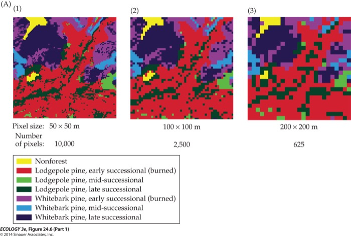
]


---

# Importance of scale

.font150[
Landscape ecologists often grapple with issues associated with spatial scale

Two important aspect of spatial scale: **grain** and **extent**

Grain refers to the spatial resolution of a study or data set; e.g., are the data or samples obtained at a resolution of 1 m<sup>2</sup>, 100 m<sup>2</sup> or 1 km<sup>2</sup>?

Extent refers to the size of the study area being considered; e.g., is the landscape small or large?

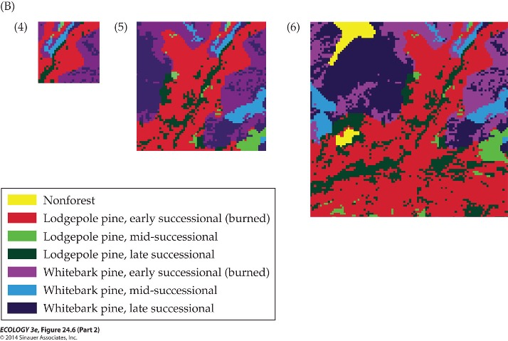
]


---

# Importance of scale

.font150[
Landscape ecologists often grapple with issues associated with spatial scale

Two important aspect of spatial scale: .blue[**grain**] and .blue[**extent**]

Grain refers to the spatial resolution of a study or data set; e.g., are the data or samples obtained at a resolution of 1 m<sup>2</sup>, 100 m<sup>2</sup> or 1 km<sup>2</sup>?

Extent refers to the size of the study area being considered; e.g., is the landscape small or large?

No fixed scale, either grain or extent, unambiguously identifies landscape ecology (a landscape ecological approach can also be applied to a very small area with fine resolution)
]


---

# Landscape Structure

## **Landscape structure**: the physical configuration of landscape elements, e.g., patch size distributions, patch dispersion, patch shapes, patch connectivity / isolation, etc.

---

# Patches in the Landscape

.font200[
- **Patches**: relatively homogenous community  types that differ from their surroundings in structure (e.g., size, shape) and in species composition
- Patches result from factors: geology, topography, soils, and climate, human activity
- The area, shape, and orientation of the landscape patches influence:
  + Habitat suitability
  + Wind flow
  + Dispersal of seeds
  + Movement of animals
]

---
class: center

.font200[E.g., Lodgepole pine stand age classes (stand ages since last major fire-disturbance) in Yellowstone National Park]

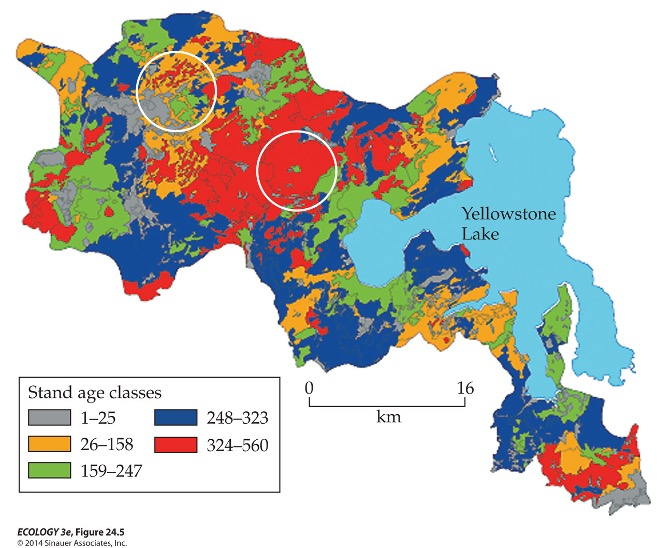

---

# Patches have edges

.pull-left[
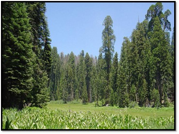
]

.pull-right[
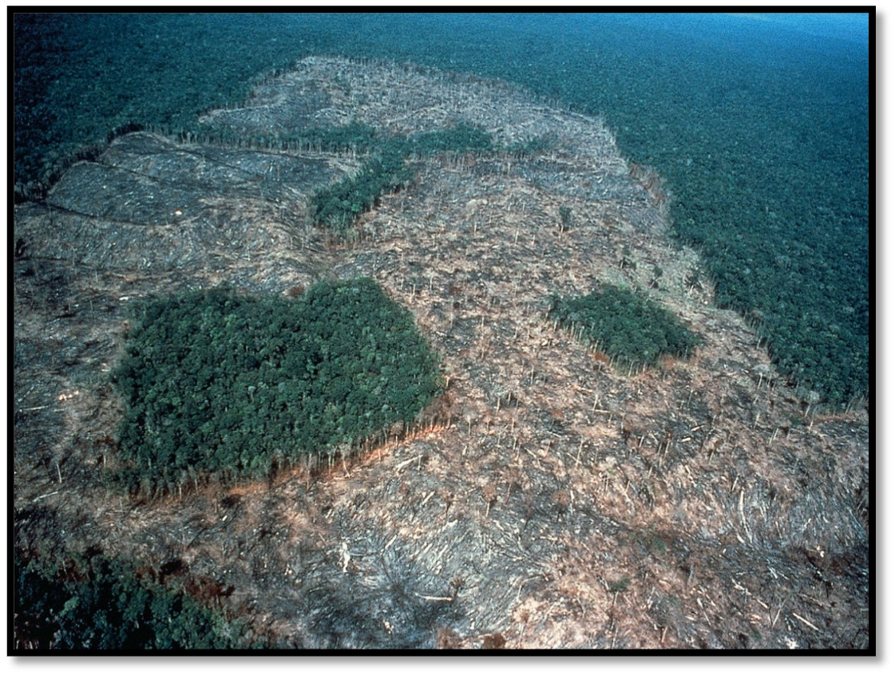
]

## Some pathces are stable and permanent (inherent edges) while others are subject to successional changes over time (induced edges)

???

Inherent edges: Natural edges, caused by changes in soil, topography. E.g., eastern North America – deciduous, coniferous edge

Induced edges: May occur where floods or fires have reversed succession. May occur where humans have created patchwork of tilled land interspersed with fence rows and wood lots

---

# Patches have edges

## The height, width, and porosity of borders influence the gradients of wind flow, moisture, temperature, and solar radiation between adjoining patches

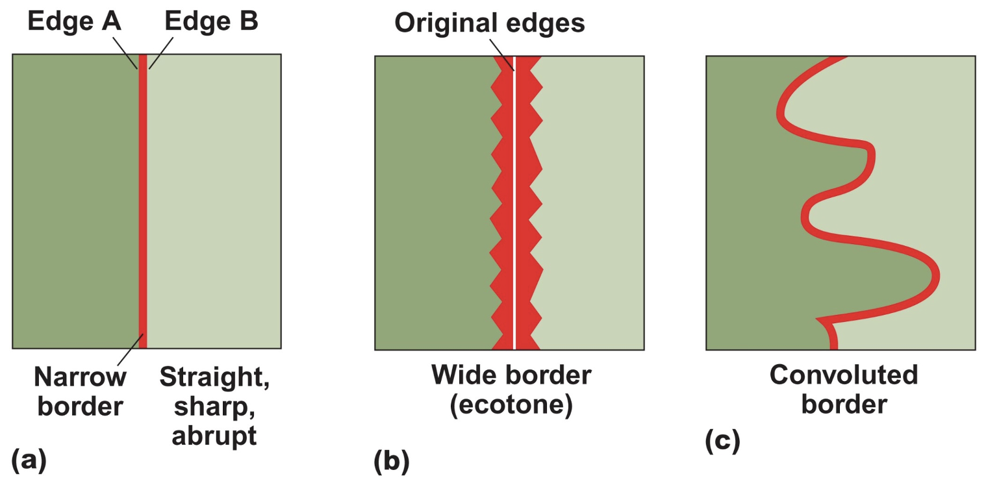

---

# Edge effects: negative (generally) effects of a habitat edge on interior conditions

.center[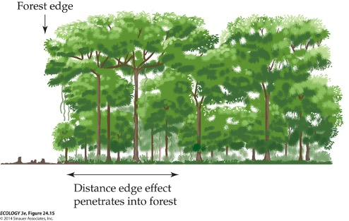]

---

# Edge effects: negative (generally) effects of a habitat edge on interior conditions

.center[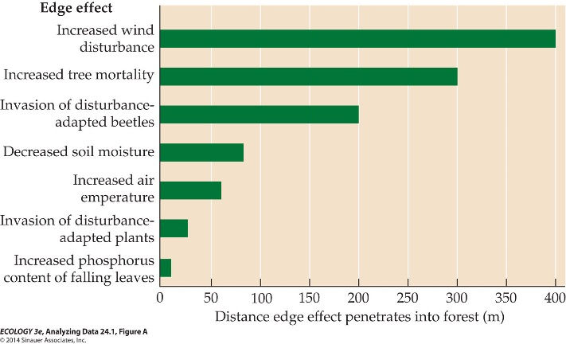]


---

## Some species can only inhabit the interior or core, and some are specifically attracted to the edge

## .blue[**Edge species**] are restricted exclusively to the edge environment  (e.g. Indigo bunting)

.center[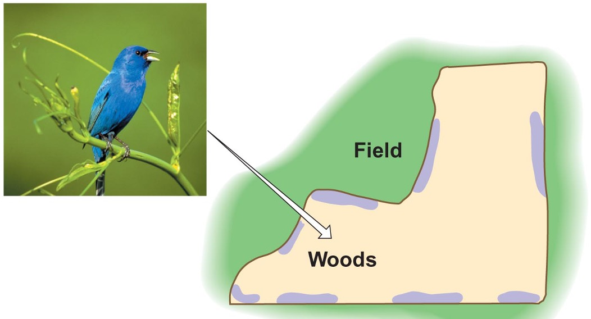]

---
background-image: url('figs/edge_sp1.jpg')
background-position: 50% 50%
background-size: contain
class: center, top

# Edge species

---
background-image: url('figs/edge_sp2.jpg')
background-position: 50% 50%
background-size: contain
class: center, top

# Interior species

---
background-image: url('figs/edge_sp3.jpg')
background-position: 50% 50%
background-size: contain
class: center, top

# Area-insensitive species


---

## The edge effect can also create problems: attracts more predator; restricts dispersal, etc.

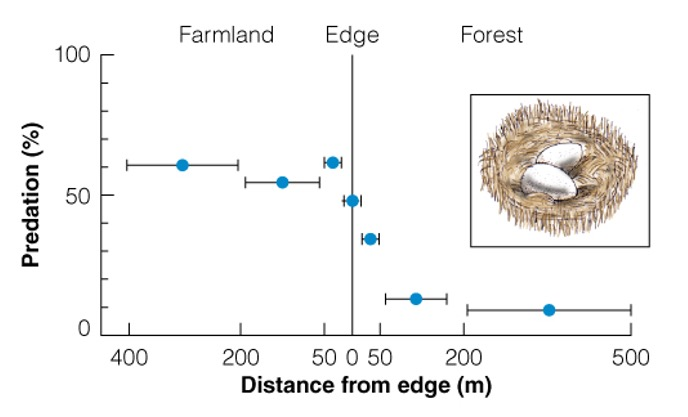

---

# Two patches with same area

.font150[The shape of a habitat reserve matters!  As patches become SMALLER, they become LARGELY EDGE, losing the characteristics of the interior community,	e.g., Brown-headed cowbird]


.center[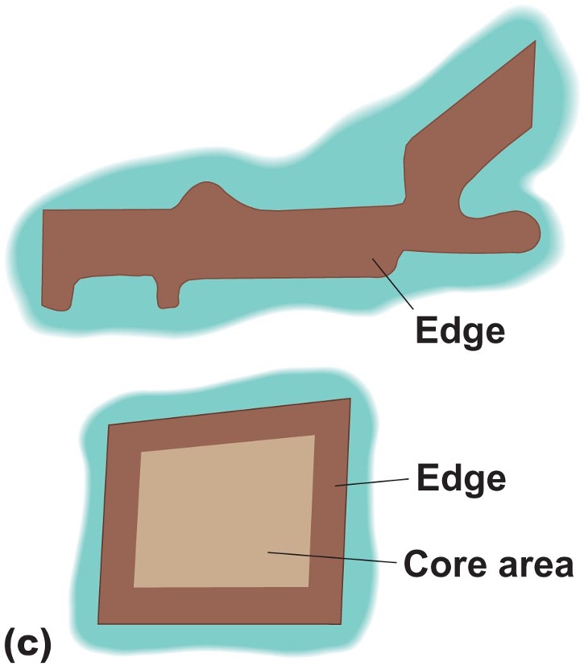]

---

# Habitat Loss & Fragmentation


.center[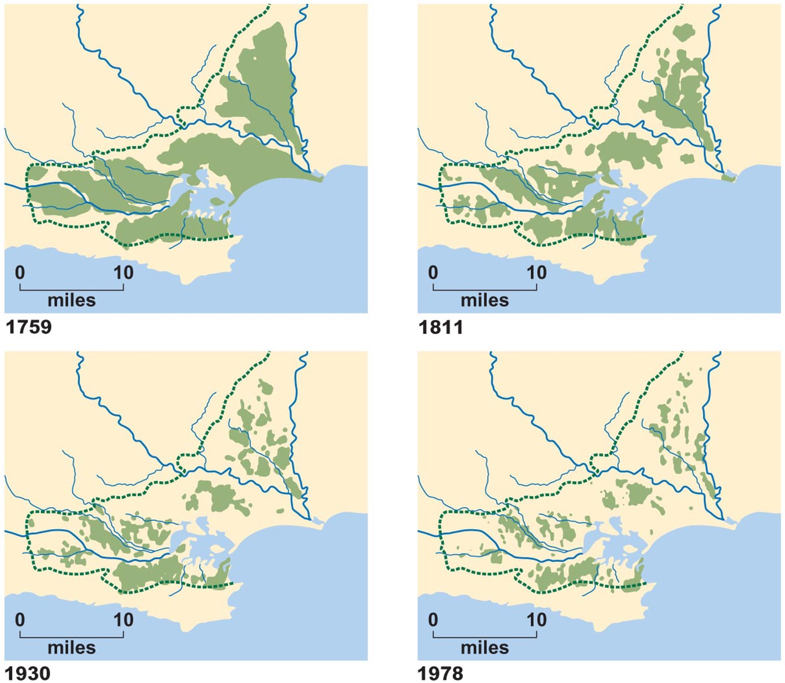]

.font130[86% of habitat lost of heathland (in England)]

???

Fragmentation and isolation of heathland (in England) 40,000 ha to 6000 ha in 218 years

1759: 10 large blocks

1978: 1084 pieces
 
86% of habitat lost. 

---

# Habitat Loss & Fragmentation


.center[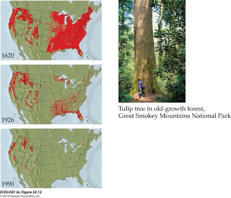]

.font130[Loss & fragmentation of U. S. old-growth forests]

---

# Habitat Loss & Fragmentation

.font200[
The primary cause of loss of biological diversity

- Loss of habitat

- Reduced population size

- Loss of genetic variation

- Increased edge

]

---

# Design Principles for Protected Areas

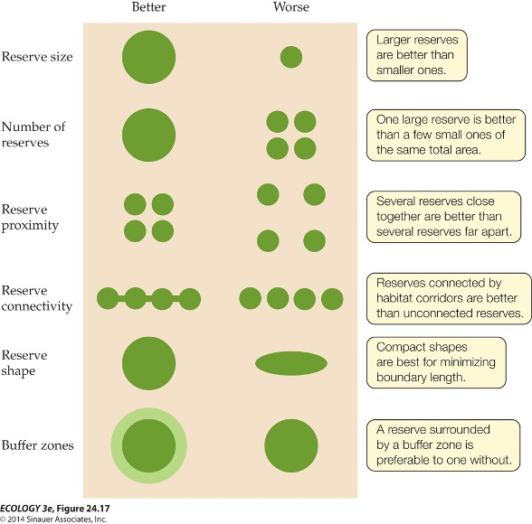

---
# The SLOSS Debate

.font150[If only a limited amount of habitat can be protected in parks and reserves, which strategy is better:  a Single Large reserve Or Several Small reserves (SLOSS)?]

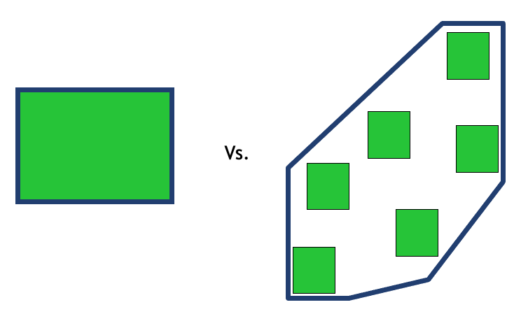

---

# The SLOSS Debate

.pull-left[
## Several small is better

### [Ecological Responses to Habitat Fragmentation Per Se](https://www.annualreviews.org/doi/abs/10.1146/annurev-ecolsys-110316-022612)
### [Why do several small patches hold more species than few large patches?](https://onlinelibrary.wiley.com/doi/full/10.1111/geb.13059)
]

.pull-right[
## Several small is not better

### [Is habitat fragmentation good for biodiversity?](https://www.sciencedirect.com/science/article/pii/S0006320718305779)
]


---

# Connectivity and Corridors

.center[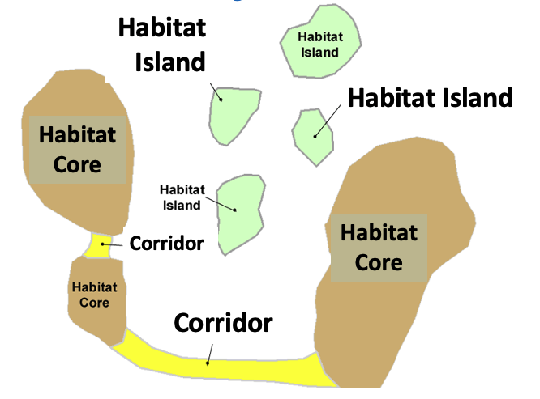]

---

## The importance of corridors in fragmented landscapes

.font150[
Corridors Permit Movement: gene flow, reestablish species (rescue effect) etc.
]

.center[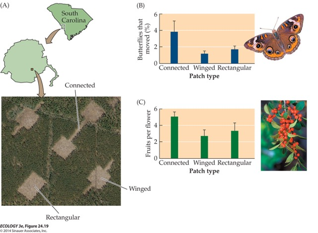]

---

## [Ongoing accumulation of plant diversity through habitat connectivity in an 18-year experiment](https://www.science.org/doi/full/10.1126/science.aax8992)

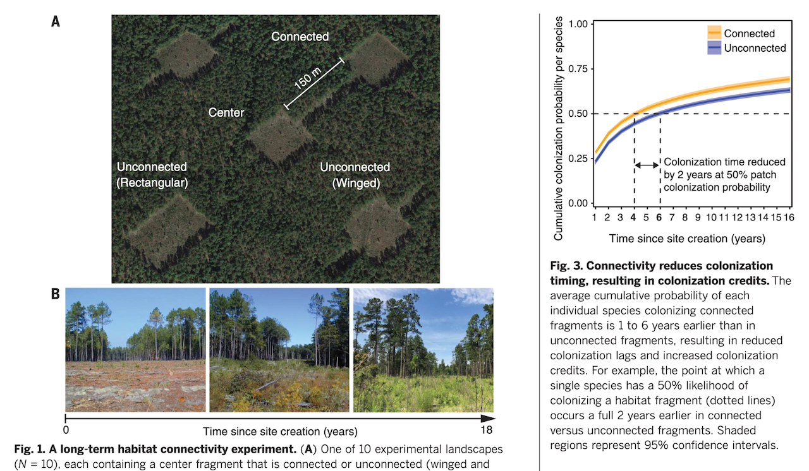

---

## Negative impacts of corridors

.font150[
- Scouting positions for predators

- Disease spread

- Pathway for the invasion of exotic species

- If too narrow, can inhibit movement of social groups
]

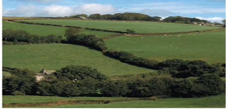

---
background-image: url('figs/y2y.png')
background-position: 50% 50%
background-size: cover
class: center, top

<br>

# .red[[Conservation & Corridors](https://y2y.net/)]

---

# Yellowstone 2 Yukon https://y2y.net/

.pull-left[
.font150[
Strategy is based on conservation requirements of grizzly bears.

Secondary focus on bird & fish species.

Priority areas: core wildlife habitat OR key corridors connecting core areas

Work with scientists, agencies, Aboriginal communities, land trusts, & some businesses.
]
]

.pull-right[
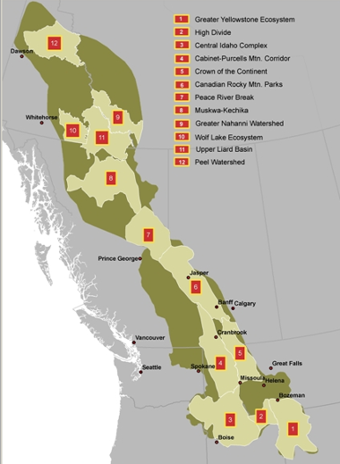
]

---

# Yellowstone 2 Yukon

.pull-left[
.font150[
Does Y2Y want the entire region to become a protected area or park?

No. Y2Y's vision is that the Y2Y region will be managed so that this world-renowned mountain ecosystem and its inhabitants (wild & human) remain healthy and connected for centuries to come. 

This requires that wild animals are able to travel safely through land adjacent to and between parks. 
]
]

.pull-right[
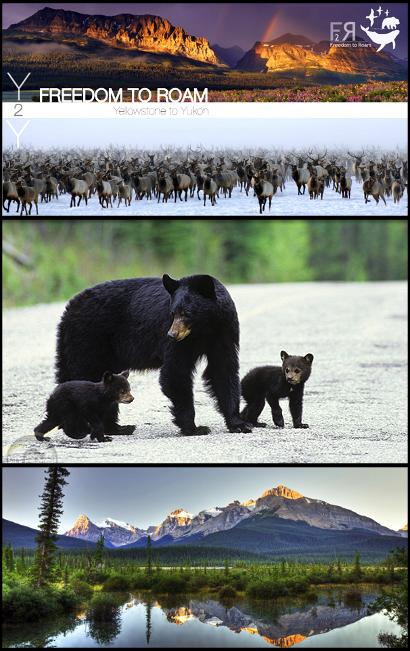
]

---

## Scaling populations to landscapes (metapopulation)

## Species-area relationships (to be covered in the Macroecology lectures)

## The theory of island biogeography (to be covered in the Macroecology lectures)
